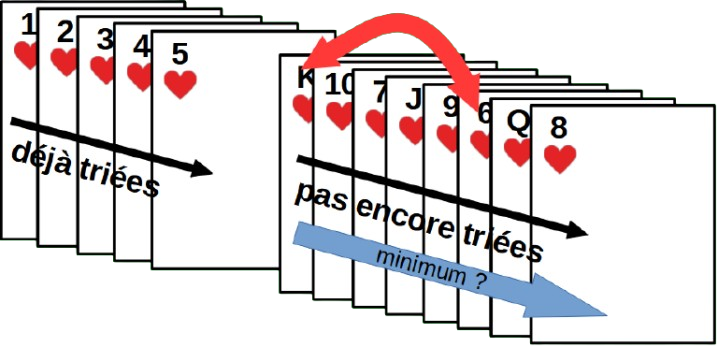
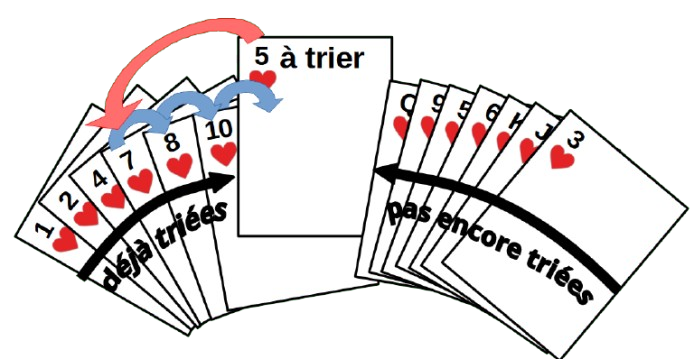

# Algorithmes de tri

Imaginons un tableau de n nombres dans un ordre quelconque. Comment faire pour le trier de façon systématique ? Attention, on ne veut pas créer un nouveau tableau, cela risquerait d'utiliser trop de place en mémoire, il faut juste modifier le tableau existant. On appelle cela un **tri sur place**.

Il existe de nombreux algorithmes de tris, étudions certains de ces algorithmes « simples » mais peu efficaces (donc rarement utilisé en pratique).

## Tri par sélection

{width=40% align=right}

Une façon simple qu'on peut utiliser pour trier un paquet de cartes consiste à séparer le paquet en deux partie : une partie déjà triée et un partie qui reste à trier. A chaque étape, on choisit la plus petite carte parmi le paquet des cartes qu'il reste à tier et on l'échange avec la première de ce paquet. On obtient une nouvelle carte triée et on recommence. C'est l'idée du **tri par sélection**.

### Algorithme

L'algorithme du tri par séléction pour trier un tableau `T` de `n` valeurs consiste donc à itérer sur les positions `i` du tableau de la position `0` jusqu'à `n` (exclus) :

- Le sous-tableau `T[:i]` contenant les valeurs de `T` jusqu'à l'indice `i` (exclus) est déjà trié.

- On cherche `i_min`, l'indice du minimum dans le sous-tableau `T[i:]` qui contient les autres valeurs qui ne sont pas encore triées.

- On échange `T[i]` et `T[i_min]`.

{width=80%}
{width=80%}

### Programme Python 

Traduit en Python, on peut écrire :

 
``` py
def tri_selection(T):
    """Trie le tableau T en place par sélection"""
    n = len(T)
    for i in range(n):   # on suppose T trié jusqu'à i exclus   

        # On cherche l'indice de la plus petite valeur après i
        i_min = i
        for j in range(i+1, n):
            if T[j] < T[i_min]:
                i_min = j

        # On échange la valeur en i avec la plus petite valeur trouvée
        T[i], T[i_min] = T[i_min], T[i]

    return T
```

Quelques remarques : 

- On peut bien sûr écrire `for i in range(n-1)` puisque à la fin de la boucle le dernier élément (position `n-1`) est de toute façon le plus grand, inutile de continuer à trier.

- On peut aussi écrire `for j in range(i, n)`, ce qui ne change rien puisque la condition `if T[j] < T[i_min]` est fausse.

- Python permet l'échange des deux valeurs en une seule instruction : `T[i], T[i_min] = T[i_min], T[i]`. Dans d'autres langages où ce n'est pas possible il faut passer par une variable temporaire :  `temp = T[i]; T[i] = T[i_min]; T[i_min] = temp;`

- La dernière instruction `return T`n'est pas nécessaire car `T`est de type `list`, un type muable, donc sa valeur est modifiée.

### Terminaison

Les boucles `for` terminent toujours donc on sait que le tri par sélection termine, inutile de chercher un **variant de boucle** dans ce cas.

### Correction

L'**invariant de boucle** du tri par sélection est le suivant : « Tous les éléments jusqu'à `i` (exclus) sont triés en ordre croissant et inférieurs à tous les éléments de `i` à la fin ». 

On va faire un raisonnement par récurrence pour vérifier que cet invariant est correct :

- Initialisation : Il est clairement vérifié au départ puisqu'il n'y a aucun élément avant l'indice `0`. 

- Conservation : Supposons qu'il est vérifié jusqu'à une valeur de `i` : Tous les éléments jusqu'à `i` (exclus) sont triés en ordre croissant et inférieurs à tous les éléments de `i` à la fin. Le prochain passage dans la boucle `for i in range(n)` consiste à chercher la plus petite valeur entre tous les éléments de `i` jusqu’à la fin et de la mettre en position `i`. Cette nouvelle valeur mise en `i`est bien supérieure à tous les éléments qui la précèdent et inférieure à tous ceux qui la suivent. On peut toujours dire que « tous les éléments jusqu'à `i+1` (exclus) sont triés en ordre croissant et inférieurs à tous les éléments de `i+1` à la fin », l'invariant est donc toujours vérifié. 

- Terminaison : Une fois que la boucle `for i in range(n)` termine, l'invariant de boucle nous assure que tous les éléments jusqu'à `n` (exclus) sont triés en ordre croissant. On a donc bien **prouvé la correction** de l'algorithme.

Cet invariant prouve la correction de l'algorithme : si l'invariant est vrai et que la boucle termine, alors le tableau complet est trié.

### Complexité

Étudions maintenant la **complexité (ou coût) temporelle** de l'algorithme pour un tableau de grande taille $n$. La boucle `for i in range(n)` se répète donc $n$ fois. Et à chaque répétition, la boucle `for j in range(i+1, n)` va faire $n-1$ comparaisons `if T[j] < T[i_min]` et quelques opérations, puis $n-2$ comparaisons, puis $n-3$ comparaisons, etc., jusqu'à $0$. Au total, on va faire : $(n-1) + (n-2) + (n-3) + ... + 2 + 1$ = $n \times (n-1) \over 2$ comparaisons et quelques opérations supplémentaires. Seul l'ordre de grandeur nous intéresse ici et on voit bien que c'est de l'ordre de $n \times n$, autrement dit que la **complexité est quadratique en $O(n^2)$**.


    
!!! abstract "Cours"   
    **Tri par Selection** :

    - Algorithme : À chaque étape, on cherche le plus petit élément parmi les éléments restants à trier et on l'échange avec la valeur en première position des éléments à trier.

    - Terminaison : Les boucles `for` terminent.

    - Correction/Invariant de boucle : Les éléments jusqu'à `i` (exclus) sont triés en ordre croissant et inférieurs à tous les éléments de `i` à la fin.

    - Complexité (ou coût) : Quadratique, en *O(n²)*.


## Tri par insertion 

{width=40% align=right}

 
La plupart des personnes utilisent naturellement le tri par insertion par exemple pour trier des cartes à jouer dans leur main en prenant les éléments un par un et en les insérant à leur place dans la partie déjà triée.

### Algorithme
L'idée est la suivante :

- Au départ, on considère que le premier élément forme une partie triée. 
- Pour chaque élément suivant, on l'insère à sa place dans la partie triée en décalant les éléments plus grands vers la droite.
- On progresse ainsi jusqu'à avoir traité tous les éléments.


L'algorithme du tri par insertion pour trier un tableau `T` de `n` valeurs consiste donc à itérer sur les positions `i` du tableau de la position `0` jusqu'à `n` (exclus) :

- Le sous-tableau `T[:i]` contenant les valeurs de `T` jusqu'à l'indice `i` (exclus) est déjà trié.

- On cherche à insérer la valeur `valeur_insertion = T[i]` à sa place dans la partie triée `T[:i]`.

- On commence à `j = i `.

- Tant que `T[j-1] > valeur_insertion` (et que `j > 0`) :

    - On décale `T[j-1]` d’une position vers la droite : `T[j] = T[j-1]`.

    - On continue vers la gauche : `j = j - 1`.

- On insère `valeur_insertion` à sa position en `j`.


{width=80%}
{width=80%}


### Programmation Python 

Le début du tableau étant déjà trié (jusqu'à i exclus), on insère la valeur en position i à sa place dans la partie triée en décalant les éléments plus grands vers la droite.


``` python
def tri_insertion(T):
    """Trie le tableau T en place par insertion"""
    n = len(T)
    
    for i in range(n):   # On suppose T trié jusqu'à i exclu
        valeur_insertion = T[i]
        
        # On décale les éléments plus grands que valeur_insertion
        j = i
        while j > 0 and valeur_insertion < T[j - 1] :
            T[j] = T[j - 1]
            j = j - 1
        
        # On insère valeur_insertion à sa place
        T[j] = valeur_insertion
    
    return T
```

Quelques remarques : 

-   On peut écrire `for i in range(1, n):` puisque la première valeur du tableau, `T[0]`,  ne peut pas être insérée avant.

-   Attention à ne pas oublier la condition `j > 0` pour ne pas repartir à la fin du tableau en `T[-1]`, `T[-2]`, etc.

-   La dernière instruction `return T`n'est pas nécessaire car `T`est de type `list`, un type muable, donc sa valeur est modifiée.


### Terminaison

Pour prouver la terminaison, il faut montrer que l'algorithme s'arrête toujours.
Preuve de terminaison :

La boucle externe `for` termine. La boucle interne `while` décrémente j à chaque itération et s'arrête dès que `j <= 0` ou que `valeur_insertion >= T[j - 1]`. Ici `j` est un **variant** de boucle qui décroît de 1 à chaque itération, la condition `j <= 0` sera nécessairement atteinte. Donc l'algorithme termine toujours


### Correction

L'**invariant de boucle** est le suivant : « À la fin de chaque itération de la boucle externe (indice `i`), le sous-tableau `T[0..i-1]` contient les mêmes éléments que le sous-tableau initial triés par ordre croissant ». 

On va faire un raisonnement par récurrence pour vérifier que cet invariant est correct :

- Il est clairement vérifié au départ, puisqu'un tableau vide est trié.

- Conservation : si l'invariant est vrai avant l'itération `i`, alors après l'insertion de `T[i]` à sa place dans `T[0..i-1]` (qui est trié), le sous-tableau `T[0..i`] est trié.

- Terminaison : quand la boucle se termine, le sous-tableau T[0..n-1], c'est-à-dire tout le tableau, est trié

Cet invariant prouve la correction de l'algorithme : si l'invariant est vrai et que la boucle se termine, alors le tableau complet est trié.


### Complexité

Dans le **pire des cas**, le tableau est trié en ordre décroissant. À chaque itération i, on effectue i comparaisons et décalages. Le nombre total d'opérations est alors : $1 + 2 + 3 + ... + (n-1)$ = ${n \times (n-1)} \over 2$. La complexité est donc la **complexité est quadratique en $O(n^2)$**..

Par contre, dans le meilleur des cas, quand le tableau est déjà trié, la boucle interne ne s'exécute jamais et donc la complexité est linéaire ou en $O(n)$.


!!! abstract "Cours" 

    **Tri par insertion**:

    Algorithme : À chaque étape, on insère un élément à sa place dans la partie triée en décalant les éléments plus grands vers la droite.

    Terminaison : La boucle `for` termine.  Le variant de boucle `j` assure que la boucle `while` termine. 

    Correction/Invariant de boucle : Les éléments jusqu'à `i` (exclus) sont triés en ordre croissant et inférieurs à tous les éléments de `i` à la fin.

    Complexité (ou coût) : Quadratique, en *O(n²)* en moyenne mais linéaire en *O(n)* dans le meilleur des cas.


## Comparaison

On peut noter que les deux tris par sélection et par insertion ont tous les deux une complexité quadratique, mais que le tri par insertion est plus efficace dans le cas d'un tableau déjà trié ou presque trié. Par contre, dans le cas d'un tableau en désordre, le tri par insertion à le désavantage de faire beaucoup plus d'échanges de valeurs dans le tableau quand on décale les éléments pour insérer une valeur à sa place.

|Critère                           |Tri par sélection|Tri par insertion|
|:-                                |:-:              |:-:              |
|Complexité                        |*O(n²)*          |*O(n²)*          |
|Complexité meilleur cas           |*O(n²)*          |*O(n)*           |
|Nombre d'échanges                 |*O(n) *          |*O(n²)*          |
|Efficace sur tableau presque trié |Non              |Oui              |

