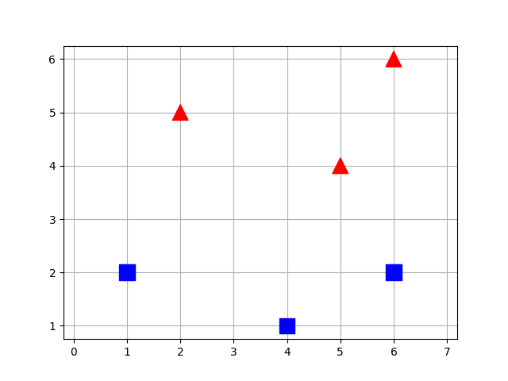
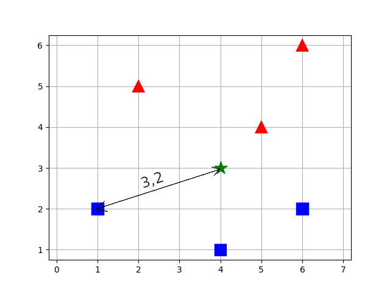
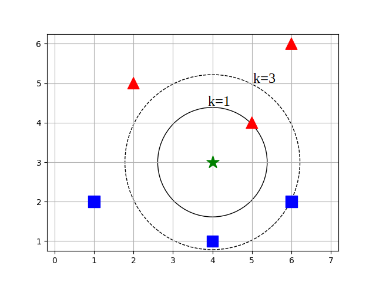

# Algorithme des k plus proches voisins

## Apprentissage automatique (*machine learning *)

L'apprentissage automatique, ou *machine learning* en anglais, est un domaine clé de l'intelligence artificielle. Il repose sur des méthodes mathématiques et statistiques qui permettent aux ordinateurs **d'apprendre à partir de données** : autrement dit, à améliorer leurs performances dans l'exécution de certaines tâches, sans que chaque étape soit explicitement programmée.

### Les deux grandes étapes de l'apprentissage automatique

1. **Phase d'apprentissage (ou entraînement)** : Le système analyse un ensemble de données connues (données d'entraînement) afin de construire un modèle. Ce modèle représente des relations ou des règles apprises à partir de ces données.

2. **Phase de mise en production (ou d'inférence)** : Une fois le modèle construit, on peut lui soumettre de nouvelles données pour obtenir une prédiction, une classification ou une décision selon la tâche ciblée.


### 🔍 Les trois types principaux d'apprentissage automatique

|Type d'apprentissage|Description|Exemples|
|:-|:-|:-|
|🧩 Apprentissage supervisé|Les données d'entraînement incluent les réponses attendues (« étiquettes »)|Prédiction météo, reconnaissance d'images|
|🔍 Apprentissage non supervisé|Les données sont brutes, sans étiquettes ; l'algorithme doit trouver des structures cachées|Regroupement de clients, segmentation marketing|
|🎮 Apprentissage par renforcement|Un agent autonome apprend en interagissant avec son environnement ; il reçoit des récompenses ou pénalités|Jeux d'échecs, optimisation robotique|


L'algorithme des k plus proches voisins (KPPV) (ou KNN pour *k-nearest neighbors*) fait partie de la famille des **apprentissages automatiques supervisés**. Il est souvent utilisé pour résoudre des problèmes de régression[^3.1] ou de classification[^3.2]. 

[^3.1]: Un problème de régression consiste à estimer la valeur d'une donnée à partir des valeurs d'autres données connues,  par exemple prédire le prix d'un bien immobilier selon ses caractéristiques.

[^3.2]: Un problème de classification consiste à déterminer à quelle classe appartient une donnée à partir des classes d'autres données connues, par exemple déterminer à quelle famille appartient un iris à partir de la longueur et la largeur des sépales et des pétales (Iris de Fischer).


Il existe d'autres formes d'apprentissage automatique, par exemple les algorithmes d'apprentissage profond (ou *deep learning*) qui s'appuient sur des réseaux de neurones artificiels à plusieurs couches, d'où le nom « profond », tels que les grands modèles de langages (ou LLLM pour *large language models*) : ChatGPT, Gemini, Mistral, etc.


## Principe des KPPV


!!! abstract "Cours" 
    L'algorithme des k plus proches voisins (KPPV) ou *k-nearest neigbors* (KNN) prédit la valeur ou la classe d'une nouvelle donnée à partir des k plus proches données parmi des données d'entraînement. La proximité est souvent mesurée à l'aide de la **distance euclidienne**[^3.3].

[^3.3]: D'autres distances existent, par exemple la distance de Manhattan calculée en utilisant les déplacements horizontaux et verticaux.

Prenons un exemple simple simple de classification : On dispose de 6 données d'entraînement identifiées par des valeurs x et y et appartenant à deux classes: des carrés bleus et des triangles rouges. On peut représenter ces données dans un plan :

{width=45% align=right}


|(x, y)|Classe|
|:-:|:-|
| (1, 2) |Carré bleu|
| (2, 5) |Triangle rouge|
| (4, 1) |Carré bleu|
| (5, 4) |Triangle rouge|
| (6, 2) |Carré bleu|
| (6, 6) |Triangle rouge|

On cherche maintenant à déterminer la classe d'une nouvelle donnée, de valeur x = 4 et y = 3. Est-ce que cette nouvelle donnée est un carré bleu ou triangle rouge ?  Pour l'instant on la représente dans le plan par une étoile verte.

🔍 Étape 1 : calcul des distances

La distance euclidienne entre deux points de coordonnées $(x_1, y_1)$ et $(x_2,y_2)$ est donnée par la formule :  $d = \sqrt{(x_1 - x_2)^2 + (y_1 - y_2)^2}$ [^3.4].

Calculons les distances entre les données d'entraînement et la nouvelle donnée :

[^3.4]: Dans un repère orthnormé.

{width=45% align=right}

|(x,y)|Classe|Distance de (4, 3)|
|:-:|:-|:-:|
| (1, 2) |Carré bleu|3.2|
| (2, 5) |Triangle rouge|2.8|
| (4, 1) |Carré bleu|2.0|
| (5, 4) |Triangle rouge|1.4|
| (6, 2) |Carré bleu|2.2|
| (6, 6) |Triangle rouge|3.6|


🎨 Étape 2 : vote des k voisins

{width=45% align=right}

L'approche la plus simple consiste à utiliser la classe du voisin le plus proche, c'est-à-dire prendre k = 1. C'est la donnée d'entraînement en (5, 4) qui se trouve à une distance de 1.4 de la nouvelle donnée: c'est un triangle rouge. 👉 On en déduit que la nouvelle donnée de valeurs (4, 3) est de la même classe, c'est donc un « triangle rouge ».


Une autre approche consiste à prendre compte plusieurs voisins, par exemple 3 voisins, c'est-à-dire prendre k = 3. Les 3 données d'entraînement les plus proches sont : 

- (4, 5) → Triangle rouge

- (4, 1) → Carré bleu

- (6, 2) → Carré bleu


Parmi ces 3 voisins, non trouve donc 2 carrés bleus contre 1 seul triangle rouge.  👉 On en déduit que la nouvelle donnée de valeurs (4, 3) est un carré bleu.

Comme on peut le voir, le choix de la valeur de k utilisée dans l'algorithme est déterminant sur le résultat obtenu ! 

Note: On choisit en principe une valeur impaire de k pour éviter les cas d'égalité entre plusieurs classes.


!!! question "Exercice corrigé" 
    Le jeu de données Iris connu aussi sous le nom de Iris de Fisher est un jeu de données multivariées présenté en 1936 par Ronald Fisher dans son papier « The use of multiple measurements in taxonomic problems » comme un exemple d'application de l'analyse discriminante linéaire. […]

    Le jeu de données comprend 50 échantillons de chacune des trois espèces d'iris (Iris setosa, Iris virginica et Iris versicolor).  Quatre caractéristiques ont été mesurées à partir de chaque échantillon : la longueur et la largeur des sépales et des pétales, en centimètres. Sur la base de la combinaison de ces quatre variables, Fisher a élaboré un modèle d'analyse discriminante linéaire permettant de distinguer les espèces les unes des autres.

    ||||
    |:-:|:-:|:-:|
    |Iris setosa|Iris versicolor|Iris virginica|
  
    Basé sur le modèle d'analyse linéaire discriminante de Fisher, ce jeu de données est devenu un cas typique pour de nombreuses techniques de classification automatique en apprentissage automatique (*machine learning*).

    Source : [https://fr.wikipedia.org/wiki/Iris_de_Fisher](https://fr.wikipedia.org/wiki/Iris_de_Fisher)

    1.  Copier le fichier [« iris.csv »](assets/iris.csv) dans vos documents et visualiser avec le blocnote son contenu. Quel est le caractère utilisé pour séparer les données dans le fichier ? Quels sont les descripteurs des données ?

    2.  Créer un nouveau programme Python enregistré dans le même répertoire que le fichier "iris.csv" puis importer les données contenues dans le fichier avec le code suivant en renseignant le caractère de séparation des données (paramètre `delimiter`) :

        ``` py
        import csv

        with open('iris.csv', 'r') as f:
            iris = list(csv.DictReader(f, delimiter='...')
        ```

    3.  Quel est le type Python de la variable `iris` ?

        a) un dictionnaire		b) un dictionnaire de tableaux	c) un tableau de dictionnaires	d) un tableau de tableaux

    4.  Ajouter au programmme une fonction `distance_euclidienne` qui prend en paramètre `iris1` et `iris2`, deux éléments de la variable `iris`, et qui renvoie la distance euclidienne entre les valeurs `('largeur_petale', 'longueur_petale')`. 

        Aide : la fonction `sqrt` du module `math` renvoie la racine carrée d'un nombre. 
        
        Attention au type de `'largeur_petale'` et `'longueur_petale'` ! 

        Exemple : 
        ``` py
        >>> distance_euclidienne(iris[0], iris[3])
        0.10000000000000009
        ```

    5.  Écrire une fonction `trier_par_distance` qui prend en paramètre `inconnu`, un dictionnaire dont les clés sont 'largeur_petale' et 'longueur_petale' et les valeurs celles d'un iris inconnu, et renvoie un tableau de dictionnaires avec les clés `'id'`, `'distance'` et `'espece'` pour chaque iris de la variable `iris`, triés par distances croissantes.

        Aide : L'instruction `distances.sort(key=lambda x: x["distance"])` permet de trier le tableau de dictionnaires `distances` contenant une clé `"distance"` par ordre croissant de cette clé. 

        Exemple : 
        ``` py
        >>> iris_inconnnu = {'largeur_petale': '0.3', 'longueur_petale': '2.1',}
        >>> trier_par_distance(iris_inconnnu)
        [[{'id': '61', 'distance': 0.7, 'espece': 'Iris-versicolor'}, {'id': '80', 'distance': 0.7, 'espece': 'Iris-versicolor'}, {'id': '58', 'distance': 0.7280109889280518, 'espece': 'Iris-versicolor'}...
        ```

    6.  Écrire la fonction `kppv` qui prend en paramètres :
        - `inconnu`, un dictionnaire contenant un iris inconnu
        - `k` un entier
        et renvoie un dictionnaire contenant le nombre d'iris de chaque espèce parmi les k plus proches voisins de l'iris inconnu.

        Exemple :
        ``` py
        >>> kppv(iris_inconnnu, k=9)
        {'Iris-setosa': 0, 'Iris-versicolor': 9, 'Iris-virginica': 0}
        ```

        


    

??? Success "Réponse"
    1.  Les valeurs sont séparées par des  virgules , les descripteurs sont : id,longueur_sepale, largeur_sepale, longueur_petale, largeur_petale, espece.

    2.  

        ``` py
        import csv

        with open('iris.csv', 'r') as f:
            iris = list(csv.DictReader(f, delimiter=',')
        ```

    3.  un tableau de dictionnaires

    4.  

        ``` py
        from math import sqrt

        def distance_euclidienne(iris1, iris2):
            x1, y1 = float(iris1['largeur_petale']), float(iris1['longueur_petale'])
            x2, y2 = float(iris2['largeur_petale']), float(iris2['longueur_petale'])
            return sqrt((x2 - x1)**2 + (y2 – y1)**2))
        ```
    
    5.  

        ``` py
        def trier_par_distance(inconnu):
            """ dict -> list[dict]
            Renvoie un tableau de dictionnaires {'id':_, 'distance':_, 'espece':_}
            pour chaque iris d'entrainement, triés par distance décroissantes
            """
            distances = []
            for i in iris:
                distances.append({'id': i['id'],
                                  'distance': distance_euclidienne(i, inconnu),
                                  'espece':  i['espece']})
            distances.sort(key=lambda x: x["distance"])
            return distances
        ```

    6.  

        ``` py
        def kppv(inconnu, k):
            """ dict, int -> dict
            Renvoie un dictionnaire contenant le nombre d'iris de chaque espèce 
            parmi les k plus proches voisins de l'iris inconnu 
            """
            especes = {'Iris-setosa':0, 'Iris-versicolor':0, 'Iris-virginica':0}
            plus_proches = trier_par_distance(inconnu)[:k]
            for pp in plus_proches:
                especes[pp['espece']] += 1
            return especes
        ```


