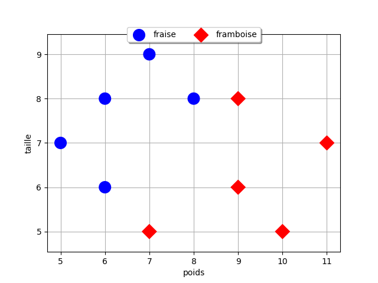
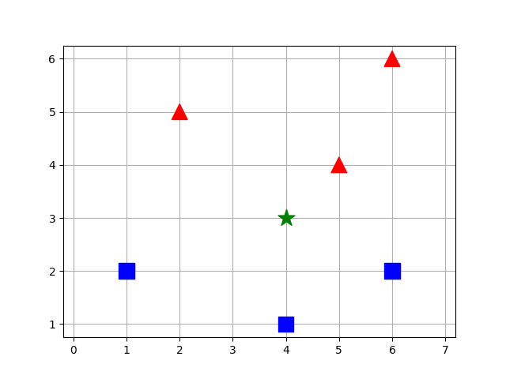

# Algorithme des k plus proches voisins

## Apprentissage automatique (*machine learning *)

L'apprentissage automatique, ou *machine learning* en anglais, est un domaine clé de l'**intelligence artificielle**. Il repose sur des méthodes mathématiques et statistiques qui permettent aux ordinateurs **d'apprendre à partir de données** : autrement dit, à améliorer leurs performances dans l'exécution de certaines tâches, sans que chaque étape soit explicitement programmée.

L'apprentissage automatique comporte généralement deux phases. Une première phase d'**apprentissage (ou entraînement)** consiste à analyser un ensemble de données connues (données d'entraînement) afin de construire un modèle. Une fois ce modèle déterminé, la seconde phase de **production (ou d'inférence)** consiste à lui soumettre de nouvelles données pour obtenir une prédiction, une classification ou une décision.


On distingue trois principaux types d'apprentissage automatique :

|Type d'apprentissage|Description|Exemples|
|:-|:-|:-|
|🧩 L'apprentissage supervisé|Les données d'entraînement incluent les réponses attendues|Prédiction météo, reconnaissance d'images|
|🔍 L'apprentissage non supervisé|Les données sont brutes, l'algorithme doit trouver des structures cachées|Regroupement de clients, segmentation marketing|
|🎮 L'apprentissage par renforcement|L'algorithme apprend en interagissant avec son environnement, il reçoit des récompenses ou pénalités|Jeux d'échecs, optimisation robotique|


L'algorithme des k plus proches voisins (KPPV) est un algorithme d'**apprentissage automatique supervisé**. 


Il existe d'autres formes d'apprentissage automatique, par exemple les algorithmes d'apprentissage profond (ou *deep learning*) qui s'appuient sur des réseaux de neurones artificiels à plusieurs couches (d'où le nom « profond »), tels que les grands modèles de langages (ou LLM pour *large language models*) : ChatGPT, Gemini, Le Chat Mistral, etc.


## Principe de l'algorithme


!!! abstract "Cours" 
    L'algorithme des k plus proches voisins (KPPV) ou *k-nearest neigbors* (KNN) permet de résoudre des problèmes de **régression** (estimer la valeur d'une nouvelle donnée) ou de **classification** (déterminer à quelle classe appartient une nouvelle donnée) à partir des k plus proches parmi des **données d'entraînement**. La proximité est souvent mesurée à l'aide de la **distance euclidienne**[^3.1].
 


[^3.1]: D'autres distances existent, par exemple la distance de Manhattan calculée en utilisant les déplacements horizontaux et verticaux.

Prenons un exemple simple de classification. Les bonbons rouges d'un célèbre confiseur appartiennent à deux **classes** différentes, certains sont au goût fraise, d'autres sont au goût framboise. On veut déterminer la classe d'un bonbon rouge inconnu. Pour nous aider, on dispose de 5 bonbons de chaque classe, ce sont les **données d'entraînement**, dont on a mesuré le poids et la taille. Il est très difficile de les différencier à vue d'oeil mais Les bonbons au goût fraise sont souvent un peu plus grands et plus légers que ceux au goût framboise.  


On a mesuré les valeurs suivantes sur les données d'entraînement :


{width=50% align=right}


|poids (g)|taille (mm)|classe|
|:-:|:-:|:-|
| 5 | 7 | fraise |
| 6 | 8 | fraise |
| 6 | 6 | fraise |
| 7 | 5 | framboise |
| 7 | 9 | fraise |
| 8 | 8 | fraise |
| 9 | 6 | framboise |
| 9 | 8 | framboise |
| 10 | 5 | framboise |
| 11 | 7 | framboise |


On veut déterminer la classe d'une nouvelle donnée: un bonbon rouge inconnu. On sait qu'il pèse 8 g et mesure 7 mm mais est-ce un bonbon au goût fraise ou au goût framboise ?  

🔍 Étape 1 : calcul des distances

La distance euclidienne entre deux points de coordonnées $(x_1, y_1)$ et $(x_2,y_2)$ dans le plan[^3.2] est donnée par la formule :  $d = \sqrt{(x_1 - x_2)^2 + (y_1 - y_2)^2}$ .

Calculons les distances entre chaque donnée d'entraînement et cette nouvelle donnée :

[^3.2]: avec un repère orthonormé.

{width=50% align=right}

|poids (g)|taille (mm)|classe|distance|
|:-:|:-:|:-|:-:|
| 5 | 7 | fraise | 3.0 |
| 6 | 8 | fraise | 2.24 |
| 6 | 6 | fraise | 2.24 |
| 7 | 5 | framboise | 2.24 |
| 7 | 9 | fraise | 2.24 |
| 8 | 8 | fraise | 1.0 |
| 9 | 6 | framboise | 1.41 |
| 9 | 8 | framboise | 1.41 |
| 10 | 5 | framboise | 2.83 |
| 11 | 7 | framboise | 3.0 |


🎨 Étape 2 : vote des k voisins

{width=50% align=right}

L'approche la plus simple consiste à utiliser la classe du voisin le plus proche parmi les données d'entraînement, c'est-à-dire k = 1. C'est le bonbon qui pèse 8 g et mesure 8 mm qui se trouve à une distance de 1 de la nouvelle donnée: il est au goût fraise. 

👉 Le bonbon inconnu est de la même classe que son voisin le plus proche, il est donc au goût fraise.


Mais on peut aussi prendre une autre approche qui consiste à prendre compte plusieurs voisins, par exemple les 3 voisins les plus proches, c'est-à-dire k = 3. Parmi les 3 bonbons les plus proches, un est au goût fraise et deux au goût framboise.  

👉 Le bonbon inconnu est de la classe majoritaire de ses 3 voisins les plus proches, il est donc au goût framboise.

Comme on peut le voir, le choix de la valeur de k utilisée dans l'algorithme est déterminant sur le résultat obtenu ! La phase d'apprentissage permet de choisir la meilleure valeur de k[^3.3]. On choisit en principe un nombre impair pour éviter les cas d'égalité entre plusieurs classes.

[^3.3] une méthode classique est la validation croisée (*cross validation*).

Dans cette exemple, nous avons étudié un problème de classification. Dans le cas d'un problème de régression, l'approche est la même en calculant la valeur moyenne des k plus proches voisins plutôt que la classe majoritaire.

## Coût de l'algorithme
Etudions le côut de l'algorithme des k plus proches voisins. Pour $n$ données d'entraînement, l'algorithme consiste à parcourir chaque donnée pour calculer sa distance avec la donnée inconnue. Le coût est donc **linéaire en $O(n)$**. 

Le tri du tableau des distance rajoute ici une compléxité supplémentaire, en $O(n^2)$ pour les tris les moins efficaces. Néanmoins on peut très bien se passer de ce tri pour optimiser l'algorithme et enregistrer directement les classes ou les valeurs des k plus proches voisins pendant le calcul des distances.

## Exemple : Iris de Fisher

Le jeu de données Iris connu aussi sous le nom de Iris de Fisher est un jeu de données multivariées présenté en 1936 par Ronald Fisher dans son papier « The use of multiple measurements in taxonomic problems » comme un exemple d'application de l'analyse discriminante linéaire. […]

Le jeu de données comprend 50 échantillons de chacune des trois espèces d'iris (Iris setosa, Iris virginica et Iris versicolor).  Quatre caractéristiques ont été mesurées à partir de chaque échantillon : la longueur et la largeur des sépales et des pétales, en centimètres. Sur la base de la combinaison de ces quatre variables, Fisher a élaboré un modèle d'analyse discriminante linéaire permettant de distinguer les espèces les unes des autres.

||||
|:-:|:-:|:-:|
|Iris setosa|Iris versicolor|Iris virginica|

Basé sur le modèle d'analyse linéaire discriminante de Fisher, ce jeu de données est devenu un cas typique pour de nombreuses techniques de classification automatique en apprentissage automatique (*machine learning*).

Source : [https://fr.wikipedia.org/wiki/Iris_de_Fisher](https://fr.wikipedia.org/wiki/Iris_de_Fisher)

!!! question "Exercice corrigé" 

    1.  Copier le fichier [« iris.csv »](assets/iris.csv) dans vos documents et visualiser avec le blocnote son contenu. Quel est le caractère utilisé pour séparer les données dans le fichier ? Quels sont les descripteurs des données ?

    2.  Créer un nouveau programme Python enregistré dans le même répertoire que le fichier "iris.csv" puis importer les données contenues dans le fichier avec le code suivant en renseignant le caractère de séparation des données (paramètre `delimiter`) :

        ``` py
        import csv

        with open('iris.csv', 'r') as f:
            iris = list(csv.DictReader(f, delimiter='...')
        ```

    3.  Quel est le type Python de la variable `iris` ?

        a) un dictionnaire		b) un dictionnaire de tableaux	c) un tableau de dictionnaires	d) un tableau de tableaux

    4.  Ajouter au programmme une fonction `distance_euclidienne` qui prend en paramètre `iris1` et `iris2`, deux éléments de la variable `iris`, et qui renvoie la distance euclidienne entre les valeurs `('largeur_petale', 'longueur_petale')`. 

        Aide : la fonction `sqrt` du module `math` renvoie la racine carrée d'un nombre. 
        
        Attention au type de `'largeur_petale'` et `'longueur_petale'` ! 

        Exemple : 
        ``` py
        >>> distance_euclidienne(iris[0], iris[3])
        0.10000000000000009
        ```

    5.  Écrire une fonction `trier_par_distance` qui prend en paramètre `inconnu`, un dictionnaire dont les clés sont 'largeur_petale' et 'longueur_petale' et les valeurs celles d'un iris inconnu, et renvoie un tableau de dictionnaires avec les clés `'id'`, `'distance'` et `'espece'` pour chaque iris de la variable `iris`, triés par distances croissantes.

        Aide : L'instruction `distances.sort(key=lambda x: x["distance"])` permet de trier le tableau de dictionnaires `distances` contenant une clé `"distance"` par ordre croissant de cette clé. 

        Exemple : 
        ``` py
        >>> iris_inconnnu = {'largeur_petale': '0.3', 'longueur_petale': '2.1',}
        >>> trier_par_distance(iris_inconnnu)
        [[{'id': '61', 'distance': 0.7, 'espece': 'Iris-versicolor'}, {'id': '80', 'distance': 0.7, 'espece': 'Iris-versicolor'}, {'id': '58', 'distance': 0.7280109889280518, 'espece': 'Iris-versicolor'}...
        ```

    6.  Écrire la fonction `kppv` qui prend en paramètres :
        - `inconnu`, un dictionnaire contenant un iris inconnu
        - `k` un entier
        et renvoie un dictionnaire contenant le nombre d'iris de chaque espèce parmi les k plus proches voisins de l'iris inconnu.

        Exemple :
        ``` py
        >>> kppv(iris_inconnnu, k=9)
        {'Iris-setosa': 0, 'Iris-versicolor': 9, 'Iris-virginica': 0}
        ```

        


    

??? Success "Réponse"
    1.  Les valeurs sont séparées par des  virgules , les descripteurs sont : id,longueur_sepale, largeur_sepale, longueur_petale, largeur_petale, espece.

    2.  

        ``` py
        import csv

        with open('iris.csv', 'r') as f:
            iris = list(csv.DictReader(f, delimiter=',')
        ```

    3.  un tableau de dictionnaires

    4.  

        ``` py
        from math import sqrt

        def distance_euclidienne(iris1, iris2):
            x1, y1 = float(iris1['largeur_petale']), float(iris1['longueur_petale'])
            x2, y2 = float(iris2['largeur_petale']), float(iris2['longueur_petale'])
            return sqrt((x2 - x1)**2 + (y2 – y1)**2))
        ```
    
    5.  

        ``` py
        def trier_par_distance(inconnu):
            """ dict -> list[dict]
            Renvoie un tableau de dictionnaires {'id':_, 'distance':_, 'espece':_}
            pour chaque iris d'entrainement, triés par distances croissantes
            """
            distances = []
            for i in iris:
                distances.append({'id': i['id'],
                                  'distance': distance_euclidienne(i, inconnu),
                                  'espece':  i['espece']})
            distances.sort(key=lambda x: x["distance"])
            return distances
        ```

    6.  

        ``` py
        def kppv(inconnu, k):
            """ dict, int -> dict
            Renvoie un dictionnaire contenant le nombre d'iris de chaque espèce 
            parmi les k plus proches voisins de l'iris inconnu 
            """
            especes = {'Iris-setosa':0, 'Iris-versicolor':0, 'Iris-virginica':0}
            plus_proches = trier_par_distance(inconnu)[:k]
            for pp in plus_proches:
                especes[pp['espece']] += 1
            return especes
        ```


