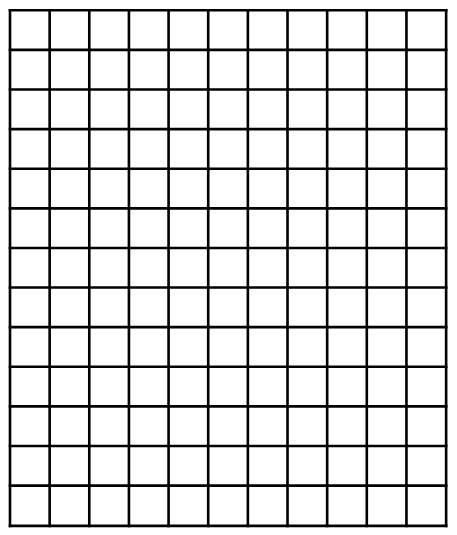
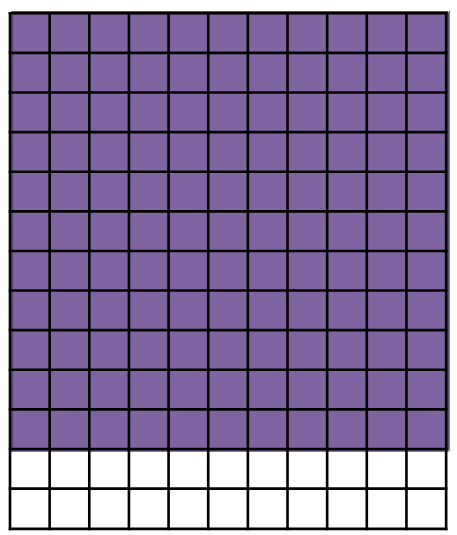
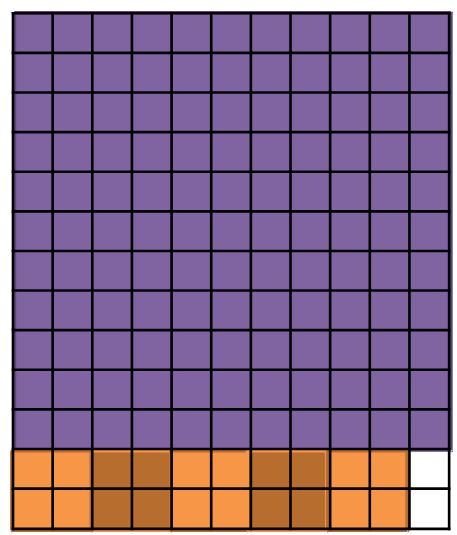
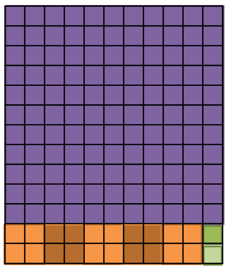
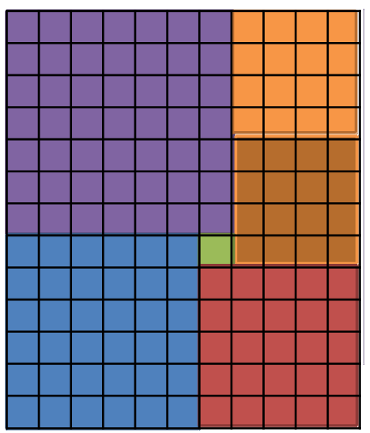

# Algorithmes gloutons

{width=30% align=right}


Prenons un premier exemple simple, un pavage de plan : comment recouvrir un rectangle, par exemple de dimension 13x11, avec un minimum de carrés, pas forcément tous identiques ? 

Pour minimiser le nombre de carrés recouvrant le rectangle, une idée simple consiste à :

1. Placer le plus grand carré possible dans le rectangle à recouvrir.

2. Recommencer l'étape 1 sur la partie du rectangle qui n'est pas recouvert, jusqu'à ce que tout soit recouvert. 

C'est le principe d'un **algorithme glouton**.

Dans notre exemple, l'algorithme va recouvrir le rectangle en 8 étapes :

|Etape 1|Étapes 2 à 6|Étapes 7 et 8|
|:-:|:-:|:-:|
||||
|On place d'abord le plus grand carré possible de dimension 11x11|Puis 5 carrés de dimension 2x2 dans l'espace restant| Et enfin 2 carrés de dimension 1x1.|

L’algorithme glouton trouve une solution au problème en utilisant 8 carrés. 

Quelques remarques :

- Le problème posé est ce qu'on appelle un problème d'optimisation sous contrainte, autrement dit un problème qui consiste à faire une **sélection** en cherchant à **maximiser** ou **minimiser** une certaine quantité tout, en respectant certaines **contraintes**. Les algorithmes gloutons se prêtent bien à la résolution de tels problèmes.

- On observe qu'à chaque étape, l'algorithme choisit **la meilleure décision possible**  (le plus grand carré possible), puis continue avec un problème **de plus en plus petit** à résoudre (la taille du rectangle à recouvrir diminue). Il n'y a **pas de retour en arrière**. Lorsqu'un choix est fait, il n'est pas modifié par la suite. 

- Mais est-ce la meilleure solution, c'est-à-dire le nombre minimum de carrés utilisés ? La réponse est non car on pouvait faire mieux !

{width=30%}

C'est le propre des algorithmes gloutons : ils **ne trouvent pas toujours la solution optimale** à un problème.


!!! abstract "Cours" 
    Un algorithme glouton procède étape par étape en prenant à chaque étape **la meilleure décision possible**  pour mener à un problème **de plus en plus petit** à résoudre, sans ce soucier de la forme du problème global et sans « retourner » en arrière. Lorsqu'un choix est fait, il n'est pas modifié par la suite.

    :warning:Un algorithme glouton **ne trouve pas toujours la solution optimale** à un problème.
    
  


Voyons maintenant quelques exemples classiques de résolution de problème par un algorithme glouton et leur programmation en Python.

## Rendu de monnaie

Dans le système monétaire de la zone euro, les pièces et billets prennent pour valeurs 1, 2, 5, 10, 20, 50, 100, 200 et 500 euros, que l'on peut représenter par le tableau de pièces (et billets) suivant :

``` py
pieces = [1, 2, 5, 10, 20, 50, 100, 200, 500]
```

Le problème est le suivant : Comment rendre un montant donné, par exemple 49 euros, en utilisant des pièces (et billets) de ces valeurs. Il existe plusieurs réponses, par exemple deux pièces de 20, 1 pièce de 5 et deux pièces de 2 conviennent. Mais quarante-neuf pièces de 1 conviennent aussi. Mais si le problème consiste maintenant à rendre 49 euros avec un minimum de pièces, il n'y a alors qu'une solution. 

C'est le problème du **rendu de monnaie**, un problème d'optimisation par contrainte qui consiste à **rendre un montant avec le nombre minimal de pièces** (et billets) choisies parmi une liste de valeurs donnée.


Analysons le problème en prenant quelques exemples :

- Le minimum de pièces pour rendre 9 est de 3 pièces : 5 + 2 + 2.

- Le minimum de pièces pour rendre 37 est de 4 pièces et billets : 20 + 10 + 5 + 2.

- Le minimum de pièces pour rendre 743 est de 6 pièces et billets : 500 + 200 + 20 + 20 + 2 + 1.

On observer qu'on trouve les pièces en ordre décroissant. En effet, l'algorithme suivi écrit en langage naturel est le suivant :

- `liste_rendu` = liste vide

- Tant que `a_rendre` > 0:
    - choisir la plus grande valeur de `pieces` inférieure à `a_rendre`
    - mettre cette valeur dans `liste_rendu`
    - diminuer `a_rendre` de la valeur

C'est bien un algorithme glouton. A chaque étape, l'algorithme prend **la meilleure décision possible**  (choisir la plus grande pièce inférieure à la somme à rendre), puis continue avec un problème **de plus en plus petit** à résoudre (la somme à rendre diminue de la dernière pièce choisie). Il n'y a **pas de retour en arrière**, lorsqu'un choix est fait, il n'est pas modifié par la suite. 

Traduit en Python, on obtient le programme suivant :

``` py 

pieces = [1, 2, 5, 10, 20, 50, 100, 200, 500]


def plus_grande_piece(pieces, a_rendre):
    """ list, int -> int
    Renvoie la plus grande valeur de pieces inférieure à a_rendre
    """
    pieces = sorted(pieces) # tri pieces en ordre croissant
    for p in pieces: # parcours du tableau trié
        if p <= a_rendre: # si p est possible
            plus_grande = p # on le garde
    return plus_grande


def rendu_monnaie(pieces, a_rendre):
    """ list, int -> list
    Renvoie le tableau de pieces obtenu par l'algorithme glouton
    """
    liste_rendu = []
    while a_rendre > 0:
        piece = plus_grande_piece(pieces, a_rendre)
        liste_rendu.append(piece)
        a_rendre = a_rendre - piece
    return liste_rendu

assert rendre_monnaie(pieces, 9) == [5, 2, 2]
assert rendre_monnaie(pieces, 37) == [20, 10, 5, 2]
assert rendre_monnaie(pieces, 743) == [500, 200, 20, 20, 2, 1]
```

Prenons maintenant un système de pièces différents de celui de la zone euro :

``` py
pieces2 = [1, 3, 6, 12, 24, 30]
```
Essayons quelques montants à rendre :
``` py
>>> rendre_monnaie(pieces2, 48) 
[30, 12, 6]
>>> rendre_monnaie(pieces2, 49) 
[30, 12, 6, 1]
>>> rendre_monnaie(pieces2, 50) 
[30, 12, 6, 1, 1]
```
On observe rapidement que l'algorithme glouton ne renvoie pas le nombre minimal de pièces à rendre, on pouvait rendre 48 avec deux pièces de 24; 49 avec deux pièces de 24 et une pièce de 1, etc. 


## Problème du sac à dos

On dispose d'un sac à dos avec une capacité maximum de poids à transporter de 15 kg. On a le choix d'emporter certains des objets dont on connaît le poids et la valeur :
{width=30%}


|Objet no| 0 | 1 | 2 | 3 | 4 | 
|:--      |:-:|:-:|:-:|:-:|:-:|
|Poids (kg)| 12 | 4 | 2 |1 | 1 | 
|Prix (€) |  40 | 100 | 20 | 20 | 10 | 

Quels objets faut-il choisir pour obtenir une valeur totale maximale tout en ne dépassant pas 15 kg ? C'est encore un problème d'optimisation par contrainte.

On voit tout de suite que l'objet 1 est intéressant car il n'est pas lourd mais a beaucoup de valeur. Par contre l'objet 0 est beaucoup moins intéressant car il est lourd et n'a pas beaucoup de valeur. Une règle de choix pertinente pour un algorithme glouton consiste donc à choisir en premier les objets qui ont la plus grande valeur par unité de poids. Ainsi, l'objet 1 a une valeur de 25 €/kg (100/4 = 25) alors que l'objet de 0 a une valeur d'environ 3.3 €/kg (40/12 = 3.333…).

L'algorithme glouton est le suivant :

- `poids_sac` = 0
- `valeur_sac` = 0
- Parcourir les objets triés en ordre décroissant de valeur/poids :
    - Si le poids de l'objet plus le poids des objets déjà dans le sac ne dépasse pas le poids autorisé : ajouter le poids de l'objet à `poids_sac` et sa valeur à `valeur_sac`.
    - Sinon, ne pas mettre l'objet dans le sac.
- Renvoyer `valeur_sac`.

Traduit en Python, on obtient le programme suivant :

```py
objets = [{'poids': 12, 'valeur': 40},
           {'poids': 4, 'valeur': 100},
           {'poids': 2, 'valeur': 20},
           {'poids': 1, 'valeur': 20},
           {'poids': 1, 'valeur': 10}]


def sac_glouton(objets, poids_max):
    """ list(dict) int -> int
    Renvoie la valeur maximale d'une liste d'objets [{'poids', 'valeur'}]
    qui peuvent être mis dans le sac sans que leur poids dépasse poids_max
    """
    poids_sac = 0
    valeur_sac = 0
    # objets pris en ordre de valeur décroissante
    for objet in sorted(objets, key=lambda x: x['valeur'], reverse=True):
        # si le poids de objet ne fait pas dépasser la capacité du sac
        if objet['poids'] + poids_sac <= poids_max:
            # on le met dans le sac
            poids_sac += objet['poids']
            valeur_sac += objet['valeur']
    return valeur_sac

assert sac_glouton(objets, 15) == 150
```

## D'autres problèmes d'optimisation par contrainte

### Choisir 5 valeurs dans un tableau

On cherche à **sélectionner** cinq valeurs parmi un tableau de nombres entiers positifs en cherchant à avoir la plus grande somme possible (**maximiser** une grandeur) et en s'interdisant de choisir deux nombres voisins (**contrainte**).

Par exemple on peut choisir dans le tableau suivant les nombres 20, 19, 18, 17 et 16 dont la somme fait 90 :
``` py
nombres = [15, 4, 20, 17, 11, 8, 11, 16, 7, 14, 19, 7, 5, 17, 2, 18, 4, 5, 13, 8]
```

!!! question "Exercice corrigé" 

    1. 
        Écrire une fonction `select_5(tab)` qui renvoie la somme de cinq nombres qui ne sont pas voisins choisis dans un tableau de nombres entiers `tab`.

        Aide : Les nombres du tableau étant tous positifs, on peut écraser la valeur des nombres sélectionnés et de ceux qui sont interdits par 0.

    2. Trouver un exemple pour lequel l'algorithme glouton n'est pas optimal.


    

??? Success "Réponse"
    1. Voyons d'abord la solution qui ne fonctionne pas :
    ``` py

    def plus_grand(tab):
        """ list -> int
        Renvoie l'indice de la plus grande valeur de tab
        """
        imax = 0
        for i in range(len(tab)):
            if tab[i] > tab[imax]:
                imax = i
        return imax


    def select_5(tab):
        """ list -> list
        Renvoie les 5 nombres de tab dont la somme est la plus grande
        sans choisir deux nombres voisins
        """
        somme = 0
        for _ in range(5):
            # on prend la plus grande valeur de tab et on la met à 0
            imax = plus_grand(tab)
            somme += tab[imax]
            tab[imax] = 0
            # les nombres voisins sont aussi mis à 0
            if imax > 0:         # si c'est n'est pas le premier élément de tab
                tab[imax-1] = 0      # on met le nombre de gauche à 0
            if imax < len(tab)- 1:   # si ce n'est pas le dernier
                tab[imax+1] =0      # on met le nombre de droite à 0
        return somme


    >>> nombres = [15, 4, 20, 17, 11, 8, 11, 16, 7, 14, 19, 7, 5, 17, 2, 18, 4, 5, 13, 8]
    >>> select_5(nombres) 
    90
    ```

    2. 
    Avec les nombres `[15, 4, 20, 17, 11, 8, 11, 16, 7, 14, 2, 7, 5, 17, 19, 18, 4, 5, 13, 8]` on obtient 84 alors qu'on pouvait choisir 20 + 18 +17 + 16 + 15 = 86


### Charger les wagons

On doit charger des containers de marchandises sur les wagons d'un train. On peut charger autant de containers qu'on le souhaite sur chaque wagon tant que la masse des containers ne dépasse pas 60 tonnes.

Par exemple, on peut charger les 18 containers qui ont les masses (en tonnes) suivantes :
   
```
containers = [32, 1, 4, 11, 16, 38, 30, 15, 40, 20, 26, 5, 25, 14, 44, 17, 7, 6]
```

sur 7 wagons en les répartissant ainsi :

```
[32, 20, 4], [30, 26], [11, 44], [40, 15, 5], [38, 17], [14, 16, 25, 1], [6, 7]
```
On cherche la répartition des containers (**sélectionner**) qui permet d'utiliser le plus petit nombre de wagons **minimiser une grandeur**) sans dépasser la capacité des wagons de 60 tonnes (**contrainte**).

On propose d'utiliser l'algorithme glouton suivant :

- train = tableau_vide
- Trier les containers en ordre croissant (du plus léger au plus lourd).
- Tant qu'il reste des containers à charger :
    - wagon = tableau vide
    - Parcourir les containers qui restent en partant de la fin (du plus lourd au plus léger) :
        - Si on ne dépasse pas 60 tonnes sur le wagon : enlever le container de la liste des containers et l'ajouter sur le wagon.
    - Ajouter le wagon au train.

!!! question "Exercice corrigé" 
    Écrire une fonction `charger(containers, pmax)` qui prend en paramètre `containers`, le tableau des poids des containers en tonne et `pmax`, la capacité d'un wagon (un nombre entier) et renvoie la répartition des containers

  

??? Success "Réponse"
    ``` py

    def charger(containers, pmax):
        """ list, int -> list[list]
        Renvoie la répartition des containers en utilisant le plus petit nombre de
        wagons sans dépasser une capacité des wagons de pmax
        """
        train = []
        # tri des containers en ordre croissant (du plus léger au plus lourd)
        containers = sorted(containers)
        # tant qu'il reste des containers à charger
        while len(containers) != 0:
            # on crée un nouveau wagon
            wagon = []
            # on parcourt containers en partant de la fin (du plus lourd au plus léger)
            i = len(containers) - 1
            while i >= 0:
                # si on ne dépasse pas pmax en mettant le container sur le wagon
                if sum(wagon) + containers[i] <= pmax:
                    # on l'ajoute au wagon et on l'enlève de containers
                    wagon.append(containers.pop(i))
                i = i - 1
            # on ajoute le wagon au train
            train.append(wagon)
        return train

    >>> containers = [32, 1, 4, 11, 16, 38, 30, 15, 40, 20, 26, 5, 25, 14, 44, 17, 7, 6]
    >>> charger(containers, 60)
    [[44, 16], [40, 20], [38, 17, 5], [32, 26, 1], [30, 25, 4], [15, 14, 11, 7, 6]]
    ```
