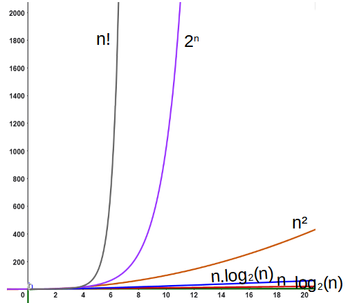

# Algorithmique

Un algorithme est une suite finie et non ambiguë d'instructions et d’opérations permettant de résoudre une classe de problèmes.

Le domaine qui étudie les algorithmes est appelé l'algorithmique. On retrouve aujourd'hui des algorithmes dans de nombreuses applications informatiques, dont dans les systèmes permettant le fonctionnement des ordinateurs, la cryptographie, le routage d'informations, la planification et l'utilisation optimale des ressources, le traitement d'images, le traitement de textes, la bio-informatique, l'intelligence artificielle, l'automatique, etc.

Les ordinateurs sur lesquels s'exécutent ces algorithmes ne sont pas infiniment rapides, car le temps de machine reste une ressource limitée, malgré une augmentation constante des performances des ordinateurs. L’analyse de la **complexité**, ou **coût** d'algorithmique permet de prédire l'évolution en temps calcul nécessaire pour amener un algorithme à son terme, en fonction de la quantité de données à traiter.

!!! abstract "Cours" 

    La **complexité d'un algorithme** mesure le nombre d'opérations élémentaires (comparaisons, affectations) qu'il effectue en fonction de la taille n des données.  

On utilise la notation O (grand O) pour exprimer un ordre de grandeur. En pratique, on retrouve principalement les complexités suivantes, de la plus rapide à la plus lente : 

-	*O(1)* - complexité **constante** : le temps d'exécution ne dépend pas de n, par exemple accéder à un élément d'un tableau ou ajouter ou supprimer le dernier élément d'un tableau (méthode .append() et .pop())
-	*O(log₂(n))* - complexité **logarithmique** : par exemple la recherche dichotomique dans un tableau trié.
-	*O(n)* - complexité **linéaire** : le temps d'exécution est proportionnel à la taille de l'entrée, par exemple le parcours séquentiel d'un tableau.
-	*O(n.log₂(n))* - complexité **log-linéaire** ou **quasi-linéaire**, le temps d'exécution est presque proportionnel à la taille de l'entrée, par exemple le tri fusion et le tri rapide (*quicksort*).
-	*O(n²)* - complexité **quadratique** : le temps d'exécution est multiplié par 4 lorsque la taille de l'entrée double,  c'est le
cas des algorithmes avec deux boucles imbriquées, par exemple les tris par sélection ou par insertion.
-	*O(2ⁿ)* - complexité **exponentielle**  et *O(n!)* - complexité **factorielle** : le temps d'exécution croit très rapidement, ces algorithmes sont impraticables sauf pour des données de petites tailles, par exemple le calcul de la suite de Fibonacci en récursif et le problème du voyageur de commerce.

Comparons les complexités avec un graphe de fonctions pour les premières valeurs de n jusqu'à 10.

{width=40%}

Les complexités quadratiques, exponentielles et factorielles semblent beaucoup moins performantes que les autres.

Changeons maintenant d'échelle pour observer l'évolution jusqu'à n = 20.

{width=40%}

Les algorithmes de  complexité **exponentielle**  et  **factorielle** deviennent très rapidement impraticables.

On peut aussi visualiser la différence avec les vitesses d'exécution sur un processeur à 5 GHz, effectuant pour simplifier $5 \times 10^9$ opérations élémentaires par secondes:

|              |log₂(n) |  n     |n.log₂(n)|   n²   |   2ⁿ     |  n!   |
|-:            |:-:     |:-:     |:-:      |:-:     | :-:      | :-:   |
|10            | < 1 ms | < 1 ms | < 1 ms  | < 1 ms |  < 1 ms  |  < 1ms|
|20            | < 1 ms | < 1 ms | < 1 ms  | < 1 ms |  < 1 ms  |15 ans |
|50            | < 1 ms | < 1 ms | < 1 ms  | < 1 ms | 2.5 jours|∞|
|100           | < 1 ms | < 1 ms | < 1 ms  | < 1 ms | 8 ans|∞|
|1 000         | < 1 ms | < 1 ms | < 1 ms  | < 1 ms |∞|∞|
|10 000        | < 1 ms | < 1 ms | < 1 ms  |  20 ms | ∞|∞|
|100 000       | < 1 ms | < 1 ms | < 1 ms  |  2 s   |  ∞|∞|
|1 000 000     | < 1 ms | < 1 ms | < 1 ms  |  3 min |  ∞|∞|
|10 000 000    | < 1 ms |  2 ms  | 50 ms   |6 heures|∞|∞|
|100 000 000   | < 1 ms | 20 ms  | 1 s     |2 ans   |∞|∞|
|1 000 000 000 | < 1 ms | 0,2 s  | 6 s     |152 ans |∞      |  ∞    |

où " ∞ " désigne des temps de plusieurs milliers d'années.

On s’intéresse aussi à :

- La **terminaison** d'un algorithme qui consiste à prouver qu'il termine. On utilise souvent un **variant de boucle** qui change de valeur à chaque itération.

- La **correction** d'un algorithme qui consiste à prouver qu'il est correct. On utilise souvent un **invariant de boucle**, une propriété vraie avant la boucle, conservée à chaque itération, et en sortie de boucle.

