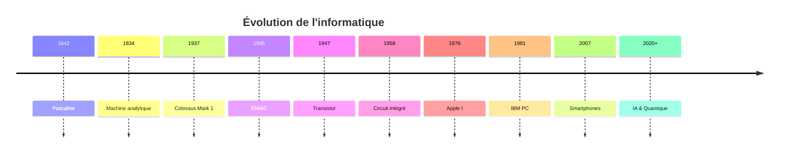
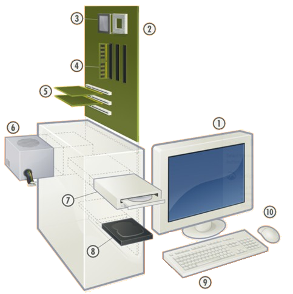
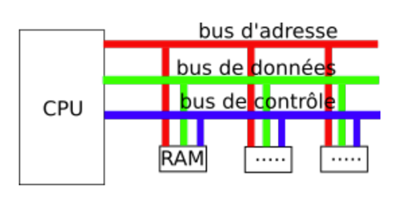

# Modèle d’architecture séquentielle (von Neumann)

## Transistors et circuits logiques

Corrigés des activités faites en classe : 

- [Transistors et Circuits Logiques](assets/[NSI] AMSE - 1.Activité Transistors et Circuits Logiques -correction.pdf).

- [Logisim](assets/[NSI] AMSE - 1.Activité Logisim -correction.pdf).

### Un peu d'histoire

---

## :material-timeline-clock: Récapitulatif chronologique

=== "Ère Mécanique (1642-1834)"
    - 1642 : Blaise Pascal crée la machine d'arithmétique (baptisée Pascaline) capable d'effectuer des additions et soustractions. 
    - 1673 : Gottfried Wilhelm Von Leibniz ajouta à la Pascaline la multiplication et la division.
    - 1820 : Apparition des premières machines à calculer industrielle.
    - 1834 : Charles Babbage conçoit l'idée d'une « machine analytique » en s'inspirant d'une machine à tisser (Jacquard) programmable à l'aide de cartes perforées. S'il ne réalise jamais cette machine, Ada Lovelace formalise ses idées et développe le premier algorithme de programmation de l'histoire, devenant la première informaticienne de l'humanité.

=== "Ère Électronique (1937-1945)"
    - 1937 : Le Colossius  Mark 1 est le premier ordinateur programmable constitué de 3300 engrenages, 1400 commutateurs reliés par 800 km de fil électrique. Il mesure 17 m de long et 2.5 mètres de large.
    - Années 40 : Les premiers ordinateurs utilisés par les militaires sont lourds et volumineux. 
    - 1945 : Premier ordinateur ne comportant plus de pièces mécaniques, l'ENIAC (*Electronic Numerical Integrator And Computer*) estIl est composé de 18000 lampes à vide et occupe 1500 m².

=== "Ère du Transistor (1947-1958)"
    - 1947 : Invention du transistor
    - Années 50 : Transition technologique, , les tubes à vide sont remplacés par des transistors
    - 1958 : Les transistors sont gravés dans du silicium donnant naissance au **circuit  intégré** (*chip*) permettant de réduire encore la taille et le coût des ordinateurs.

=== "Ère Personnelle (1970+)"
    - Années 70 : Les premiers ordinateurs personnels voient le jour pour le grand public.
    - 1976 : Steve Wozniak et Steve Jobs créent le Apple I dans un garage.
    - 1981 : IBM commercialise le premier "PC".
    - 2007 : C'est l’apparition des premiers smartphones.

---

!!! tip "Pour aller plus loin"
    L'histoire de l'informatique continue d'évoluer avec l'**intelligence artificielle**, l'**informatique quantique** et les **technologies émergentes**.

### Transistors

Un transistor est essentiellement un interrupteur électronique qui laisse passer un courant ou pas. Nous pouvons faire correspondre ces deux états aux deux chiffres 1 et 0 (ou aux valeurs booléennes True et False). 
Il est composé de trois parties : une source S, une grille G et un drain D. La source et le drain sont soit connectés, soit déconnectés, selon la valeur de la grille (0 ou 1).

Il existe plusieurs styles de transistors, voici deux des plus courants :

{width=50% align=right}
Source: [https://en.wikichip.org/wiki/mosfet](https://en.wikichip.org/wiki/mosfet)

- Transistor nMOS :
	-	Si une tension positive ( 1 ) est appliquée à la grille le courant peut passer entre S et D.
	-	Si une tension nulle est appliquée à la grille ( 0 ) le courant ne peut pas passer entre S et D.

- Transistor pMOS :
	-	Si une tension positive ( 1 ) est appliquée à la grille le courant ne peut pas passer entre S et D.
	-	Si une tension nulle ( 0 ) le courant peut passer.

### Portes logiques

Il est possible de fabriquer des composants à l’aide des transistors pour réaliser des opérations booléennes ou des opérations. On appelle ces circuits des **portes logiques**. 

Les principales portes logiques sont les suivantes (en représentation classique dite américaine[^1.1]):
{width=80%} 

[^1.1]: En représentation « rectangulaire », dite « européenne » les portes sont représentées par des boites rectangulaires contenant le symbole de la porte.

Les portes **NAND et NOR sont dites universelles**, elles permettent chacune de fabriquer les autres portes logiques.

### Circuits combinatoires

Lorsqu'on assemble des portes logiques entre elles on peut obtenir des **circuits combinatoires** : ce sont des circuits électroniques qui comportent plusieurs entrées (généralement notées A, B, C …) pour fournir un résultat en sortie. La **table de vérité** que l'on obtient correspond au tableau de valeurs d'une fonction booléenne. 

Le circuit combinatoire est le terme "concret / électronique" alors que le terme fonction booléenne est le terme "théorique / mathématique".

{width=30% align=right}
{width=30% align=right}

On peut par exemple construire le circuit ci-contre, appelé  « demi-additionneur » .
Codée sur un bit, sa table de vérité est :

|A  | B |A ⊕ B|	Retenue|
|:-:|:-:|:-:   |:-:|
| 0 | 0	| 0	   | 0 |
| 0 | 1	| 1	   | 0 |
| 1 | 0	| 1	   | 0 |
| 1 | 1	| 0	   | 1 |

## Architecture von Neumann

Corrigé de l'activité faite en classe : 

- [Architecture von Neumann](assets/[NSI] AMSE - 2.Architecture von Neumann - correction.pdf).

### Différents constituants d’une machine

{width=40% align=right}

|Parties matérielles|	No|	Entrée|	Sortie|
|:-|:-:|:-:|:-:|
|Souris                     | 10| ✓ |   |
|Lecteur de disques (CD/DVD)| 7 | ✓ |   |	
|Mémoire vive (RAM)	    	| 4 |   |   |	
|Processeur (CPU)	        | 3 |   |   |		
|Écran ou moniteur	        | 1	|   | ✓ |
|Disque Dur                 |8  | ✓ | ✓ | 
|Carte mère                 | 2 |   |   |		
|Clavier                    | 9	| ✓ |  	|
|Alimentation électrique    | 6 |   |   |		
|Cartes sons, réseaux, etc.	 | 5 |✓| ✓| 

   
Un ordinateur est une machine qui sert à **traiter des informations**[^1.2] grâce à des programmes. Il peut recevoir, stocker, modifier et afficher des informations.

- **Recevoir l’information** : cela se fait avec des appareils appelés **périphériques d’entrée** comme le clavier, la souris, le micro, la webcam, le scanner ou l’écran tactile.

- **Stocker l’information** : l’ordinateur utilise sa mémoire. La **mémoire de masse** (disque dur, clé USB…) garde les données même quand l’ordinateur est éteint. La **mémoire vive (RAM)** est utilisée pendant que l’ordinateur fonctionne et a besoin d’électricité.

- **Transformer l’information** : c’est le rôle du **processeur (CPU)**. Il lit les instructions et fait les calculs nécessaires.

-  **Afficher le résultat** : l’information est envoyée vers des **périphériques de sortie** comme l’écran, l’imprimante ou les enceintes audio.

[^1.2]: Le mot informatique vient d’ailleurs de la contraction des mots information et automatique.

###  L'architecture von Neumann

L'architecture de von Neumann, proposée par John von Neumann en 1945, est le modèle fondamental sur lequel reposent la plupart des ordinateurs actuels. Ce modèle révolutionnaire introduit le concept de programme enregistré : **les programmes et les données sont stockées dans la même mémoire**. Selon ce modèle, un ordinateur s’articule autour de quatre parties distinctes :

{width=50% align=right}

1.	Le processeur ou CPU : C’est le "cerveau" de l'ordinateur. Il se compose de deux parties principales : 

    -	L’**unité arithmétique et logique (UAL)** pour les calculs  arithmétiques (+, -, ×, ÷) et opérations  logiques (ET, OU,  NON, comparaisons) ;

    - 	l’**unité de commande (UC)** coordonne  et synchronise toutes les opérations, décode les instructions et gère le séquencement. Elle contient une horloge système qui rythme l'exécution ;

    -	ainsi que des registres, petites mémoires ultra-rapides intégrées au processeur qui stockent temporairement les données.

2.	la **mémoire** où sont stockés ensembles les données et les programmes.
3.	des **bus** qui sont des fils conduisant des impulsions électriques et qui relient les différents composants.
4.	des **périphériques d’entrées-sorties** (E/S ou I/O pour *Input/Output*) pour échanger avec l’extérieur.

### Les architectures multiprocesseurs

{width=50% align=right}
Depuis, les ordinateurs ont beaucoup évolué, surtout sur deux points :
    • Les entrées et sorties sont maintenant gérées par de petits processeurs spécialisés, comme la carte graphique, qui s’occupe de l’affichage.
    • Les ordinateurs possèdent aujourd’hui plusieurs processeurs ou plusieurs cœurs dans un même processeur pour avoir plus de puissance sans augmenter la vitesse (une vitesse trop élevée fait chauffer le processeur).
Aujourd’hui, **la mémoire est devenue un élément central de l’ordinateur**, avec beaucoup d’échanges de données en même temps.

### Les périphériques d’entrée-sortie (E/S ou I/O)

Un **périphérique** est un matériel électronique pouvant être raccordé à un ordinateur par une **interface d’entrée-sortie** (interface VGA, HDMI, USB, RJ45), le plus souvent par l’intermédiaire d’un **connecteur**.
Les interfaces d’entrées-sorties les plus usuelles sont :
    • USB qui permet la connexion de périphériques reconnu par l’ordinateur sans le redémarrer ;
    • RJ45 qui permet une connexion à un réseau filaire ;
    • VGA ou HDMI qui permet la connexion à un écran ;
    • SATA qui permet la connexion à un disque dur.

### L’unité de commande (UC) et le rôle de l’horloge

L’**unité de commande** ou unité de contrôle (**UC**) lit les instructions dans la mémoire les unes après les autres de façon séquentielle, cadencée par une **horloge**. L’unité est appelée un **cycle** d’horloge. 
La **fréquence de l’horloge s’exprime en hertz (Hz)**, c’est le nombre d’opérations que fait le processeur par seconde. 

Les processeurs modernes ont généralement une vitesse comprise entre 1 GHz (gigahertz) et 3,8 GHz, les modèles haut de gamme pouvant atteindre des vitesses encore plus élevées. Par exemple 3 GHz correspond à 3 milliards d’opération à la seconde.  Mais la fréquence d’horloge n’est pas la seule donnée à prendre en compte pour comparer la performance des CPU.
Dans un processeur RISC[^1.3], 5 cycles sont parfois nécessaires pour traiter une instruction. Pour gagner du temps, le processeur n’exécute pas toujours les instructions de façon séquentielle mais exécute simultanément plusieurs instructions qui sont à des étapes différentes de leur traitement.

La performance d’un processeur est souvent mesurée par le **nombre d'instruction par seconde (IPS)** : Il est obtenu en multipliant la **fréquence d'horloge du processeur (en Hz) par son nombre d’instructions par cycle (IPC)**. 
On l'exprime généralement en million d'instructions par seconde (MIPS).

[^1.3]: On distingue deux types d’architecture. Les processeurs CISC (*Complex Instruction Set Computer*) comme ceux d’Intel exécutent la plupart des instructions élémentaires en une période d'horloge, tandis qu'il faut généralement quatre ou cinq périodes d'horloge à un processeur RISC (*Reduced Instruction Set Computing*) comme ceux d’ARM pour le même résultat.

### L’unité arithmétique et logique (UAL)

L’**Unité Arithmétique et Logique (UAL)** est la partie du processeur qui réalise les calculs et les opérations logiques élémentaires. Selon le processeur, cette unité peut réaliser des opérations plus ou moins complexes, sur des nombres plus ou moins longs.

### La mémoire
#### Hiérarchie de la mémoire

On peut prendre pour analogie l'accès à une information écrite sur des feuilles de papiers qui se trouvent 1/ sur votre bureau, 2/ dans votre tiroir, 3/ dans le meuble d'archives dans la pièce voisine, et 4/ dans des cartons au sous-sol. Accéder à une information sur une feuille de votre bureau est bien plus rapide que de descendre au sous-sol, mais par contre il y a beaucoup moins de place sur votre bureau qu’au sous-sol. Il en va de même pour un ordinateur.

Il existe plusieurs types de mémoire dans un ordinateur et les différentes sortes de mémoires qui coexistent se distinguent par leur capacité et leur vitesse. En voici les principales :

- registre internes du processeur
- mémoire cache du processeur (Static RAM)
- mémoire centrale (Dynamic RAM)
- supports de masse : disques durs, clé USB, etc.

Une mémoire est caractérisée par : 

- sa **capacité** : le volume d’informations que la mémoire peut stocker, par exemple une RAM de 1Go ou un disque dur de 1 To .
- Sa **vitesse ou temps d’accès** : l’intervalle de temps qui s’écoule entre la demande de lecture/écriture par le processeur et son exécution.  L'accès à un **disque dur est des milliards de fois plus lent que l'accès au cache**.

#### Registres
Un registre est un emplacement de mémoire interne à un processeur. C’est la mémoire la plus rapide d'un ordinateur.  Les registres sont utilisés pour stocker des opérandes et des résultats intermédiaires lors des opérations effectuées dans l'UAL (Unité Arithmétique et Logique) du processeur. 

#### Mémoire cache SRAM (Static Random-access memory) ou antémémoire
L’accès à la mémoire centrale n’est pas immédiat alors que les échanges entre le processeur et la mémoire sont nombreux. La mémoire cache située à l’intérieur ou très près du processeur fait l’intermédiaire entre les registres et la mémoire centrale pour stocker les mots de mémoire les plus utilisés.

#### Mémoire centrale DRAM (Dynamic Random-access memory)
La mémoire centrale contient le code et les données des programmes exécutés par le processeur. 
La capacité de la mémoire centrale d’un ordinateur personnel actuel est de 8Go à 16Go. La RAM se présente sous forme de barrettes, un circuit imprimé de forme rectangulaire enfichable sur la carte mère et qui comporte sur ses deux faces des puces mémoires.

#### Mémoire de masse
La mémoire de masse désigne les moyens de stockage permanent de grande capacité qui permettent de mémoriser de l’information après l’arrêt de l’ordinateur, par exemple les disque durs, clé USB, DVD, etc. Elle est accessible en lecture et écriture et s’apparente  à un périphérique d’entrée/sortie. La capacité est mesurée en giga à téraoctets.

- Disque dur magnétique : Constitué de plateaux métalliques recouvert d’une matière magnétisable. 
- Le disque SSD : Constitué de mémoires flash, il est moins fragile et plus silencieux qu’un disque magnétique. 
- Clé USB : Support de masse amovible qui se branche sur l’interface USB et contient de la mémoire flash.

#### Mémoire morte ou ROM (Read Only Memory)
Il existe aussi la mémoire morte ou ROM qui joue un rôle un peu à part. Permanente et accessible principalement en lecture, elle est utilisée pour stocker les informations nécessaires au démarrage d’un ordinateur (BIOS). 

{width=80% }

{width=80% }

#### Unité de mémoire

L’unité de base de mesure de la mémoire est l’octet (égal à 8 bits) et les préfixes usuels (**kilo**, **méga**, **giga**, etc .) sont couramment utilisés.
Cependant, ces derniers sont liés à la base 10 et en réalité assez mal adaptés à un univers de la base 2. C’est pourquoi ont été inventés des  préfixes spécifiques à la mesure de la mémoire informatique. Partant du principe que $10^3$ ≈ $2^{10}$, on utilise les préfixes **kibi**, **mébi**, **gibi**, etc. dont la définition est donnée ci-dessous. 

|Nom             |  Valeur théorique		            ||Nom	           |Valeur théorique|
|:-|-:|:-:|:-|-:|
|1 ko (kilooctet)|	$10^3$ = 1 000 octets               ||1 kio (kibioctet)| $2^{10}$ = 1 024 octets|
|1 Mo (mégaoctet)|	$10^6$ = 1 000 000 octets		    ||1 Mio (mébioctet)| $2^{20}$ = 1 048 576 octets|
|1 Go (gigaoctet)|	$10^9$ = 1 000 000 000 octets	    ||1 Gio (gibioctet) | $2^{30}$ = 1 073 741 824 octets|
|1 To (téraoctet)|	$10^{12}$ = 1 000 000 000 0000 octets ||1 Tio (tébioctet)| $2^{40}$ = 1 099 511 627 776 octets|

{width=30% align=right}

Même si ces notations sont assez anciennes (1998), nombreux sont les informaticiens et logiciels à utiliser encore kilo, méga, giga-octets pour désigner en réalité des kibi, mébi, gibi-octets, par exemple sur cet affichage de Windows Disk Manager utilisant le sigle Go au lieu de Gio. 

### Bus de communication
Lorsque le processeur exécute un programme il doit pouvoir communiquer avec les autres composants de la machine, notamment avec la mémoire centrale pour lire les instructions du programme ou avec les périphériques pour recueillir des données. Ce sont les bus de l’ordinateur qui permettent cette communication.

Un **bus** est un composant électronique qui permet à différents composant d’échanger des informations. Il peut être vu comme un **ensemble de fils permettant de véhiculer de l’information sous forme de bits**. 

La **bande passante** représente le nombre d’octets véhiculés par seconde par le bus, en Mo/s. 

{width=30% align=right}

Il existe, sans entrer dans les détails, 3 grands types de bus :

- Le bus d’adresse permet de faire circuler des adresses (par exemple l’adresse d’une donnée à aller chercher en mémoire).
- Le bus de données permet de faire circuler des données.
- Le bus de contrôle permet de spécifier le type d’action (écriture d’une donnée en mémoire, lecture d’une donnée en mémoire, etc). 

    
## Assembleur

Corrigé de l'activité faite en classe : 

- [Assembleur](assets/[NSI] AMSE - 3.Assembleur - correction.pdf).

### Langages de bas niveau/haut niveau

Le langage Python, comme de nombreux autre langages informatiques tels que C ou Java, sont des langages dit de « haut niveau ». Ils permettent une programmation rapide et plus simple. Ils sont aussi portables, c’est à dire qu’on peut coder un programme en Python et utiliser le code source sur différents ordinateurs sans ce soucier du type de processeur. Le processeur de l’ordinateur ne sait pas exécuter directement ces langages de haut niveau. 

{width="50%" align=right}
{width="50%" align=right}

### Langage machine et assembleur

Le langage natif du microprocesseur est le **langage machine**, c'est le seul langage qu'il puisse traiter. Il est composé d'**instructions et de données codées en binaire**. Le **langage assembleur associe des noms aux instructions binaires du langage machine**, afin qu’il soir lisible par un humain. Le langage machine et l’assembleur sont des langages dit de  « **bas niveau** » constitués d'instructions très élémentaires. 

Chaque type de processeur a un langage assembleur qui lui est propre, mais tous se ressemblent beaucoup.

- Chaque instruction effectue une opération de base et il faut de nombreuses instructions pour réaliser une  ligne de code dans un langage de haut niveau.

- On ne peut pas créer de variables. Les données sont stockées dans la mémoire ou dans des registres.

- Il n’y a pas de structures comme `if`, `while` ou `for`.

- Les instructions s’exécutent les unes après les autres. On peut placer des repères (étiquettes ou labels) pour faire des sauts dans le programme.

- Les calculs se font uniquement avec les registres (dans les processeurs RISC). Si les valeurs sont en mémoire, il faut d’abord les charger dans des registres pour les utiliser.

### Processeurs CISC et RISC

Chaque famille de processeurs utilise un jeu d'instructions différent, même si on retrouve souvent les mêmes. Les microprocesseurs actuels se répartissent en deux grandes familles qui se distinguent par la conception de leurs jeux d'instructions:

- Les processeurs **CISC** (*Complex Instruction Set Computer*) avec beaucoup d’instructions complexes. Une seule instruction peut faire plusieurs actions à la fois, comme lire une valeur, faire un calcul et enregistrer le résultat. Les instructions les plus compliquées prennent plusieurs cycles d’horloge (entre 2 et 10).

- Les processeurs **RISC** (*Reduced Instruction Set Computer*) avec moins d’instructions et des instructions plus simples. Chaque instruction fait une seule action. Elles ont toutes la même taille et s’exécutent généralement en un seul cycle d’horloge.

Les processeurs Intel ont une architecture CISC, ceux d’Apple sont en RISC. On retrouve aussi des processeurs de type RISC dans différents SoC[^1.3], des objets connectés ou embarqués comme les cartes Arduino, des cartes d’ordinateurs SBC[^1.4], etc.

[^1.3]: « *System On a Chip* » pour « système sur une puce » est un système complet embarqué sur une seule puce.

[^1.4]: « *Single Board Computer* » ou ordinateur monocarte est un ordinateur complet construit sur un circuit imprimé.