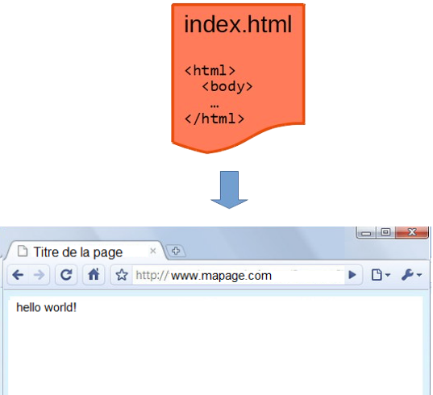
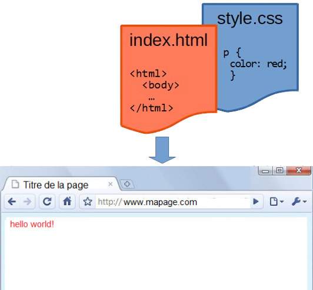
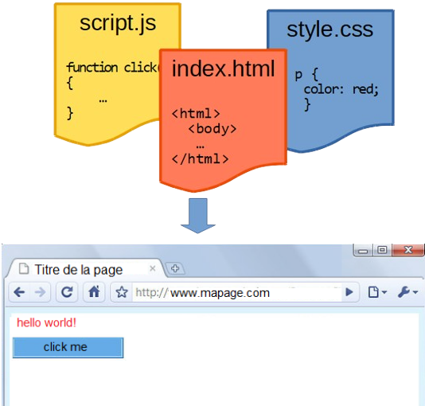

# Modalités de l’interaction entre l’homme et la machine


Corrigés de l'activité faite en classe : 

- [IHM Web (1)](assets/[NSI] IHM Web (1) - Modalité, évènements, boutons et formulaires (correction).pdf).

## Le web

Le **World Wide Web** (littéralement la « toile (d’araignée) mondiale », abrégé www ou le *Web*) est inventé en 1989 par Tim Berners-Lee et Robert Cailliau au CERN. Il permet de consulter dans un navigateur des pages accessibles sur des sites. Le Web n’est qu’une application parmi d’autres fonctionnant sur Internet,
comme le courrier électronique, la visioconférence et le partage de fichiers en pair à pair. Attention à **ne pas confondre le Web et l'Internet** comme beaucoup de personnes le font!

Le Web repose sur trois technologies :

- Le protocole de transfert **HTTP** (*HyperText Transfer Protocol*) ou HTTPS en version sécurisée ;
- le langage **HTML** (*HyperText Markup Language*) ; et
- les **URL** (*Uniform Resource Locator*) couramment appelées adresse web.

Dans se première version, le Web 1.0, les utilisateurs consultent des pages statiques. A partir des années
2000, avec le Web 2.0, les utilisateurs peuvent interagir à travers des pages dynamiques et
interactives (réseaux sociaux, vidéos en ligne, blogs, etc.). Le Web 3.0 voit la décentralisation des données.


### HTML

{width=25% align=right}


!!! abstract "Cours" 
    HTML (*HyperText Markup Language*) est un **langage de balisage**[^1.1], permettant de structurer le contenu d'une page web pour être affiché dans un navigateur. 

[^1.1]: HTML est un langage informatique, mais ce n'est pas un langage de programmation


Exemple d’un élément  HTML : 

```html
<p>Mon premier paragraphe en HTML</p> 
```


Dans cet exemple, `<p>` est la balise ouvrante de l’élément ; `</p>` est la balise fermante correspondante.

Certaines balises n’ont pas de balise fermante, elles sont orphelines (par exemple `<br>` ou ``).

Les éléments peuvent avoir des attributs ajoutés dans leur balise ouvrante, sous la forme `attribut="valeur"`, par exemple un attribut `href` dans une balise `<a>` permet de créer un hyper lien : `<a href="https://www.fr.wikipedia.org">Wiki</a>`.

Un document HTML bien formé doit être constitué d’un élément `<html>`, contenant un élément `<head>` avec les caractéristiques générales de la page, et un élément `<body>` avec le corps du document. 


Rappel des principales balises HTML :

|Balise ouvrante|	Balise fermante|	Rôle|
|:-:|:-:|:-|
|`<!DOCTYPE html>`||Document écrit en HTML|
|`<html>`|`</html>`|Zone contenant du code HTML|
|`<head>`|`</head>`|En-tête du document|
|`<title>`|`</title>`|Titre du document|
|`<body>`|`</body>`|Contenu de la page|
|`<h1>` à `<h6>`|`</h1>` à `</h6>`|	6 niveaux de titre |
|`<p>`|`</p>`|Paragraphe|
|`<ol>`, `<ul>`, `<li>`|`</ol>`, `</ul>`, `</li>`|Liste numérotée, à puce, élément de liste|
|`<i>`, `<b>`, `<u>`|`</i>`, `</b>`, `</u`>|Texte en italique, gras, souligné|
|`<br>`||	Retour à la ligne|
|`< !--`|`	-->	`|Commentaire|
|<`a  href=...>`|`</a>`|Lien hypertexte|
|<`img src=...alt=...>`||		Afficher une image|


### CSS

{width=25% align=right}


!!! abstract "Cours" 
    CSS (*Cascading Styles Sheet*) est le langage qui s'occupe de la **présentation visuelle** d'une page web.
    
Exemple d’une règle CSS :		 

```css
p {
    color: darkblue;
    font-family: arial; 
}
```

Dans cet exemple, `p` est le sélecteur, il détermine quels éléments seront affectés. Il est suivi entre accolades de propriétés de style (par exemple « `color` ») auxquelles on donne une valeur (par exemple  « `darkblue` »).  Les propriétés et leur valeur sont séparées par « `:` ». 

Un sélecteur peut cibler :

- tous les éléments d’un même type, par exemple de type `<p>` : `p { color: darkblue ; }`

- tous les éléments contenant un même attribut `class`, par exemple  `class="important"` : `.important { border : solid }`

- un élément unique identifié par un attribut `id`, par exemple `id="special"` : `#special {background-color:yellow }`

On peut aussi combiner les sélecteurs, par exemple attention à ne pas confondre :

- `#special, a {…}` : tous les éléments `<a>` et  l’élément identifié par `id="special"` ;
- `#special a {…}` : tous les éléments `<a>` à l’intérieur de l’élément identifié par `id="special"` ;
-`p.important a {…}` : tous les éléments `<a>` à l’intérieur d’un élément `<p class="important">`.


Il existe de nombreuse propriétés CSS par exemple :

|Propriété|	Description|	Exemple|
|:-|:-|:-|
|`color`|	Couleur du texte|	`color: darkblue`|
|`background-color`|	Couleur du fond|	`background-color: red`|
|`border`|	Épaisseur, style et couleur du bord|	`border: 2px solid green`|
|`width`|	Largeur de l’élément|	`width: "50%:`|
|`font`|	Police de caractère|	`font: italic 12pt sans-serif`|

Le code CSS est écrit directement dans le document HTML à l’intérieur d'un élément `<style>` placé dans l’élément `<head>`, ou dans un fichier séparé relié par l’élément `<link>` : `<link rel="stylesheet" href="style.css">`

### JavaScript

{width=25% align=right}


!!! abstract "Cours" 
    JavaScript[^1.2] est un **langage de programmation** qui permet d’écrire des pages web dynamiques et interactives. A la différence de PHP, **JavaScript s’exécute dans le navigateur** de l’utilisateur. 

[^1.2]: Il n’a rien à voir avec le langage Java.

On retrouve les mêmes structures de base dans tous les langages informatiques, mais la syntaxe varie. Comme beaucoup d'autres langages, la syntaxe de JavaScript provient du langage C (avec des spécificités).

Les principaux types de données sont :

|||
|:-|:-|
|Nombres|	entiers : `123` et flottants : `123.456`|
|Chaînes|	`"texte"` ou `'texte'`|
|Booléens|	`true` et `false`|
|Tableaux|	`T = [1, 2, 3]`		`T[1]`		`T.length`|
|Dictionnaires|	`d = {a: 1, b: 2, c: 3}`		`d.a`|


Et les principales instructions (une différence importante avec Python : les blocs sont délimités par « `{...}` » les instructions se finissent par « `;` ») :

|||
|:-|:-|
|Déclaration|	`let nomVariable;` ou  `var nomVariable;` | 
|Affectation|	`nomVariable = expression;`|
|Instruction conditionnelle|	`if (expression) {instructions}  else if {instructions}`      (facultatif) `else {instructions}`         (facultatif)|
|Boucle bornée|	`for (i = 0; i < 10; i = i + 1) {instructions}` |
|Boucle non bornée|	`while (expression) {instructions}`|
|Fonction|	`function nomFonction(paramètres) {instructions}`|
|Commentaires|	`// commentaire` (ne pas confondre avec la division entière Python)|
|Opérateurs booléens|	et : `&&`			or : `||`		not : ``!|

On peut écrire du code JavaScript directement dans le document HTML à l’intérieur d’un élément `<script>` en fin de document juste avant `</body>`, ou dans un fichier séparé relié par  l’attribut `src` : `<script src="script.js"></script>`.


## Événements

!!! abstract "Cours" 
    Un événement correspond en général à un **changement d'état** ou à une **intervention de l'utilisateur**, par exemple quand l’utilisateur survole un paragraphe avec la souris ou  clique sur un bouton.

La **programmation événementielle** est un paradigme de programmation dans lequel l'**exécution est déclenchée lorsqu'un événement survient**.  

Il existe de nombreux événements qu’on peut « capturer » dans une page HTML, par exemple :


|Événements	|Changement d’état ou action de l’utilisateur|
|:-|:-|
|`mouseover`, `mouseout`	|Quand la souris passe sur l'élément, sort de l’élément.
|`mouseup`, `mousemove`	|Quand le bouton de la souris est relâché, quand  la souris bouge.
|`click`, `dblclick`|	Quand l’utilisateur clique, double-clique.
|`focus`, `blur`|	Quand un élément gagne le focus, perd le focus.
|`submit`|	Quand un formulaire est envoyé.|

On capture un événement dans un élément HTML en ajoutant un  attribut formé de `on` suivi du nom de l’événement, par exemple l’attribut  `onclick` permet de capturer l’évènement `click`.


## Boutons

!!! abstract "Cours" 
    Les **interactions entre l’homme et la machine** peuvent prendre de nombreuses formes sur le Web : cliquer sur un lien pour charger une page web, saisir du texte dans une zone de texte, etc. et les nombreux éléments HTML permettent de configurer toutes ces formes d’interactions, en particulier les **boutons**.

Voici un exemple de code d'un bouton qui affiche le texte 'Cliquez ici' jusqu'à ce que l'utilisateur clique dessus (événement `click`) et affiche 'Vous avez cliqué'. Quand la souris quitte le bouton (événement `mouseout`), le bouton reprend le texte initial 'Cliquez ici' :

```html
<button onclick="this.innerHTML='Vous avez cliqué'" 
   onmouseout="this.innerHTML='Cliquez ici'">Cliquez ici</button>
```
Vous pouvez le tester ici: <button onclick="this.innerHTML='Vous avez cliqué'" 
   onmouseout="this.innerHTML='Cliquez ici'">Cliquez ici</button>

## Formulaires

!!! abstract "Cours" 
    Les formulaires sont un autre type d’interactions entre l’homme et la machine sur le Web très courant. Un formulaire s’écrit avec des éléments de type `<input>` placés entre les balises `<form>` et `</form>`.

Voici un exemple de code d'un formulaire qui demande le nom et le prénom de l'utilisateur et affiche le message 'Bonjour' suivi du prénom et du nom saisis quand l'utilisateur clique sur Envoyer:

```html
<form>
    Nom: <input type="text" name="nom">
    Prénom: <input type="text" name="prenom">
    <input type="button" value="Envoyer" onclick="bonjour(this.form)">
</form>

Vous pouvez tester le code ici :
<script>
function bonjour(f) {
    alert('Bonjour ' + f.prenom.value + ' ' + f.nom.value );
}
</script>
```

<form>
    Nom: <input type="text" name="nom">
    Prénom: <input type="text" name="prenom">
    <input type="button" value="Envoyer" onclick="bonjour(this.form)">
</form>

<script>
function bonjour(f) {
    alert('Bonjour ' + f.prenom.value + ' ' + f.nom.value );
}
</script>

## Séparer les codes dans des fichiers externes

Une bonne pratique pour avoir un code plus lisible et un affichage plus rapide est de séparer les codes CSS et JavaScript dans des fichiers externes.  

On indique dans le fichier HTML l’emplacement du code CSS et du programme Javascript par :

- `<link rel="stylesheet" href="style.css">  (dans l’élément <head> )` et 
- ` <script src="script.js"></script>`  (juste avant la balise fermante  `</body>` ).