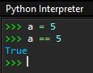

# Opérations, comparaisons, expression


## Opérateurs arithmétiques sur les nombres
Les opérations arithmétiques usuelles sont effectuées sur des nombres et/ou des variables de types ```int``` ou ```float``` :

|opérateur|notation|
|---|:-:|
|addition|```a + b```|
|soustraction|```a - b```|
|multiplication|```a * b```|
|puissance|```a**b```|
|divisions décimale|```a / b```|


``` python 
>>> a = 5
>>> b = 2
```

!!! tip inline end "PEP-8" 
    Entourer les opérateurs (```+```,  ```-```, ```/```, ```*```) d'un espace avant et d'un espace après.

``` python 
>>> a + b
7
>>> a / b
2.5
>>> a**b
25
```


> Le résultat d’une opération est de type ```float``` si ```a``` ou ```b``` est de type ```float```, sinon de type ```int```, sauf pour la division où le résultat est toujours ```float```.

> Pour obtenir la racine carrée d’un nombre on peut utiliser ```a ** 0.5```.

> L’ordre des priorités mathématiques est respecté.


### Division entière (ou division euclidienne) 
L'opérateur de division entière ```//``` et l’opération modulo ```%``` utilisés avec des entiers (de type ```int```) donnent respectivement le quotient et le reste d'une division euclidienne. Si `a` et `b` sont des entiers tels que $a = b \times q + r$,  alors ```a // b``` donne $q$ et ```a % b``` donne $r$[^1].

[^1]: 
      Vrai pour des entiers positifs. Attention aux surprises avec des nombres relatifs ! Les résultats sont différents entre langages/systèmes informatiques. En Python on peut tester `7 // -5` et `-17 // 5` qui donnent tous les deux `-4` mais `17 % -5` donne `-3` alors que `-17 % 5`  donne `3`.


|opérateur|notation|
|---|:-:|
|quotient|```a // b```|
|reste|```a % b```|

{align=right}.
{align=right}.

Par exemple, le quotient et le reste de la division entière de $17$ par $5$ sont $3$ et $2$ respectivement ($17 = 2  \times 5 + 2$)

``` python
>>> a = 17
>>> b = 5
>>> a // b				
3
>>> a % b
2
```
On peut affecter une valeur à une variable qui dépend de son ancienne valeur, par exemple l’augmenter d’une quantité donnée (on dit **incrémenter**)[^2].
``` python
>>> a = 3				
>>> a = a + 1				
>>> a					
4
```

!!! tip inline end "PEP-8" 
    Pas d'espace autour du signe `*` pour montrer la priorité sur l'addition.

``` python
>>> a = 2*a + 1		
>>> a
9
```


[^2]: 
     Noter dans cet exemple la différence entre variable informatique et mathématique, et la signification du signe =. En mathématique $a = 2*a + 1$ est une équation dont l’inconnue est $a$ (on peut la résoudre facilement et trouver la solution $a = -1$). En informatique, c’est une affectation qui remplace le contenu de la variable `a` part une nouvelle valeur égale à `2*a + 1`, (même si $a \neq -1$).

Des raccourcis d’écriture existent pour aller plus vite (mais attention aux erreurs en les utilisant !)

- ```a += 1``` signifie ```a = a + 1```;
- ```a += b``` signifie ```a = a + b``` ; et
-  ```a *= 2``` signifie ```a = a * 2```.


## Opérateurs sur les chaines de caractères 

Les textes ou chaines des caractères, de type ```str``` (abréviation de *string*) sont définis  entre une paire de guillemets (```"```) ou d’apostrophes (```'```)

``` py
>>> chaine1 = 'hello'
>>> chaine2 = "world"
```
Pour les chaînes de caractères, deux opérations sont possibles, l'addition et la multiplication [^3]:

[^3]:
  Attention : les opérateurs `+` et `*` se comportent différemment s'il s'agit d'entiers ou de chaînes de caractères : `2 + 2` est une addition alors que `'2' + '2'` est une concaténation, `2 * 3` est une multiplication alors que  `'2' * 3` est une duplication.

- L'opérateur d'addition « `+` » **concatène** (assemble) deux chaînes de caractères.
``` py
>>> chaine1 + chaine2
'hello world'
```

- L'opérateur de multiplication « `*+*`» entre un nombre entier et une chaîne de caractères **duplique** (répète) plusieurs fois une chaîne de caractères. 
``` py
>>> chaine1 * 3
'hellohellohello'
```

La fonction `len()` donne le nombre de caractère d’une chaine (y compris les espaces et ponctuation).

``` py
>>> ch = 'hello world !'
>>> len(ch)
13
```

Chaque caractère d’une chaine de caractères `ch` a une position qui va de `0` à `len(ch) - 1`. 

- On peut accéder au premier caractère avec `ch[0]`, au second avec `ch[1]`, … au caractère en iieme position par `ch[i]`. 
:warning: Le premier caractère est `ch[0]`, et non pas `ch[1]` !
```py
>>> ch[6]	
'w'
```

- De même, en partant de la fin, on peut accéder au dernier caractère avec `ch[-1]`, à l’avant dernier avec `ch[-2]`, etc. 
```py
>>> ch[-1]
'!'
```
!!! tip inline end "PEP-8" 
    Pas d'espace autour du signe « `:` ».

- On peut enfin accéder à la sous-chaîne de tous les caractères entre `i` et `j - i`, appelée une tranche, avec `ch[i:j]`.
```py
>>> ch[2:5]
'llo'
```

On peut aussi vérifier l’appartenance, ou pas, d’une chaine dans une autre avec `in` et `not in` :
``` py
>>> "py" in "python"
True
>>> "Py" not in "python"
True
```
Il existe de nombreuses méthodes[^4] pour traiter les chaines de caractères, en voilà quelques exemples :

[^4]: Une méthode est un type de fonction particulier propre aux langages orientés objet. Remarquer la construction `nom_variable.nom_methode()` dans ces cas différente de `nom_fonction(nom_variable)` par exemple `len('abc')`.


|fonction|description|exemple|
|---|---|---|
|`.index('c')`| trouve l'index du premier caractère `"c"` dans une chaîne.|`>>> chaine = 'aaabbbccc'`<br>`>>> chaine.index('b')`<br>`3`|
|`.find('sc')`| cherche la position d'une sous-chaîne `sc` dans la chaîne.|`>>> chaine.find('bc')`<br>`5`|
|`.count('sc')`| compte le nombre de sous-chaînes `sc` dans la chaîne.|`>>> chaine.count('bc')`<br>`1`|
|`.lower('sc')`| onvertit une chaîne en minuscules.|`>>> 'ABCdef'.lower()`<br>`'abcdef'`|
|`.upper('sc')`| onvertit une chaîne en majuscules.|`>>> 'ABCdef'.upper()`<br>`'ABCDEF'`|
|`.replace('old', 'new')`| remplace tous les caractères `old` par `new`  dans la chaîne.|`>>> 'aaabbbccc'.replace('c', 'e')`<br>`'aaabbbeee'`|


## Opérateurs de comparaison
Les opérations mathématiques de comparaison peuvent être effectuées sur des valeurs. Le résultat est toujours un booléen (de type `bool`) égal à `True` ou `False`[^5] .

[^5]: `True` et `False` (et `None`) sont les rares mots en Python qui s’écrivent avec une majuscule. `TRUE` ou `true` ne sont pas acceptés.

!!! tip inline end "PEP-8" 
    Entourer les opérateurs (`==`, `!=`, `>=`, etc.) d'un espace avant et d'un espace après.

|opérateur|notation|
|---|:-:|
|=|```a == b```|  
|≠|```a != b```|  
|<|```a < b```|  
|≤|```a <= b```|  
|>|```a > b```|  
|≥|```a >= b```|  

[^6]

[^6]: On préfèrera `is` et `is not` à `==` et `!=` pour comparer à `None`. On écrit `a is not None` plutôt que `a != None`.

```py
>>> a, b, c = 5, 5, 6
>>> a == b
True
>>> a == c
False
```
On peut aussi combiner les comparaisons. Pour vérifier si `a` est compris entre 2 et 6 ou entre 7 et 8 on peut écrire :
```py
>>> 2 <= a < 6
True
>>> 7 < a < 8
False
```

Attention, c’est en fait une combinaison de plusieurs comparaisons, ce qui peut donner des hérésies mathématiques : 
```py
>>> 4 < a > 2
True
```
On peut aussi comparer les chaines de caractères par ordre lexicographique, c’est-à-dire que l’on commence par comparer le premier caractère de chacune des deux chaînes, puis en cas d’égalité on s’intéresse au second, et ainsi de suite comme quand on cherche un mot dans un dictionnaire. Attention aux majuscules et aux nombres écrits dans des chaînes  [^7]:

[^7]: Les comparaisons entre chaînes de caractère se font en comparant le point de code Unicode de chaque caractère. Il est donné par la fonction `ord()` (la fonction `chr()` fait ‘inverse ). Par exemple, `ord('A')` vaut `65` et `ord('a')` vaut `97` donc `'A' < 'a'` est vrai.

```py
>>> 'aa'>'ab'
False
>>> "python" == "python"	
True
>>> "python" != "PYTHON"
True
>>> "java" < "python"	
True
>>> "java" > "Python"
True
>>> "10" < "2"
True
```

Les nombres de type `int` ou `float` peuvent être comparées entre eux s'ils sont de  types différents :
```py
>>> 17 == 17.0
True
>>> 0.0 < 1
True
```
Mais pas les nombres avec les chaines de caractères :   
```py
>>> 17 == "17"
False
```
:warning: Attention aux égalités entre nombres de type `float` qui ne sont pas toujours encodés de façon exacte [^8] :
```py
>>> 0.1 + 0.1 + 0.1 == 0.3
False
```

[^8]: Les `floats` sont encodés par une fraction binaire de numérateur sur 53 bits et de dénominateur une puissance de 2. Dans le cas de `0.1`, la fraction binaire est $3602879701896397/2^{55}$.  Pour afficher toutes le décimales on peut faire: `format(.1,'.55f')`.  Une particularité de Python est de ne pas limiter l’encodage des `int`, on peut par exemple comparer `2*1000` avec `2.**1000`.


##	Opérateurs logiques (ou booléens)

Les opérations logiques peuvent être effectuées sur des booléens. Le résultat est un booléen égal à `True` ou `False`.


|opérateur|notation|description|priorité|
|---|:-:|:-:|:-:|
|Négation de `a`|`not a`|`True` si `a` est `False`, `False` sinon|1|
|`a` et `b` (conjonction)|`a and b`|`True` si `a` et `b` sont `True` tous les deux, `False` sinon|2|
|`a` ou `b` (disjonction)|`a or b`|`True` si `a` ou `b` (ou les deux) est `True`, `False` sinon|3|

(`a` et `b` sont des booléens).

Comme pour les opérations mathématiques, les opérations logiques suivent des règles de priorité : 

1. Négation (`not`), 
2. Conjonction (`and`), 
3. Disjonction (`or`).

`a or not b and c` est équivalent à `a or ((not b) and c)` mais en pratique, on met des parenthèse.

## Expressions

!!! abstract "Cours" 
    Une **expression** (ne pas confondre avec une [instruction](3-instructions.md)) est le résultat d’un calcul d’opérations ou de comparaisons sur des variables, des nombres, etc.

Exemples :

- `2*a + 5`	est une expression qui prend la valeur 2 fois la valeur de `a` plus 5.  

- `a = 5`	n’est PAS une expression, c’est une affection de la valeur 5 à la variable `a`.

- `a == 5`	est une expression qui prend la valeur `True` si `a` est égal à 5, ou la valeur `False` sinon.


{align=right}

On observe dans la console Python quand on entre une expression, elle est évaluée par l’interpréteur et le résultat est affiché. Quand on entre une affectation, rien n’est affiché.

Puisqu'elle a une valeur, une expression peut être affectée à une variable : 
`b = a**2` est une affectation de la valeur de l’expression `a**2` (le carré de a) à la variable `b`.


!!! question "Exercice corrigé" 
	On donne une variable `annee` de type `int`. Par exemple `annee = 2023`.
    Ecrire l’expression booléenne (qui vaut True ou False) qui indique si `annee` est une année bissextile ou pas.
    « Depuis l'ajustement du calendrier grégorien, l'année sera bissextile (elle aura 366 jours) seulement si elle respecte l'un des deux critères suivants :

    1. C1 : l'année est divisible par 4 sans être divisible par 100 (cas des années qui ne sont pas des multiples de 100) ;
    2. C2 : l'année est divisible par 400 (cas des années multiples de 100).

    Si une année ne respecte ni le critère C1 ni le critère C2, l'année n'est pas bissextile ».
    
    Source: [https://fr.wikipedia.org/wiki/Année_bissextile](https://fr.wikipedia.org/wiki/Année_bissextile).

        

??? Success "Réponse"
	Avant d'écrire cette expression on peut se poser quelques questions :

	- Comment savoir si un nombre est divisible par un autre ? On vérifie que le reste de la division entière est égal à zéro. Par exemple 2023 n'est pas divisible par 4 car le reste de la division entière de 2023 par 4 est 3 : 
    ``` py
    >>> annee = 2023
    >>> annee % 4
    3
    ```
    Par contre 2024 est divisible par 4 car le reste de la division entière de 2024 par 4 est 0 : 
    ``` py
    >>> annee = 2024
    >>> annee % 4
    0
    ```
    - On peut traduire directement en Python chaque condition C1 et C2 :

        C1 : l'année est divisible par 4 sans être divisible par 100 (cas des années qui ne sont pas des multiples de 100) ;
        `>>> annee % 4 == 0 and annee % 100 != 0`

        C2 : l'année est divisible par 400 (cas des années multiples de 100).
        `>>> annee % 400 == 0 `

    - :warning: la dernière clause indique qu'une année **n'est pas** bissextile si les conditions C1 **et** C2 sont toutes les deux **fausses**. Il faut donc comprendre qu'une année **est** bissextile si C1 **ou** C2 (ou les deux) est **vraie**.
    
	
	Traduit en Python, on obtient l'expression suivante que l'on peut tester dans la console.

    !!! note inline end "" 
    	On pourrait se passer des parenthèses et utiliser les règles de priorités des opérateurs booléens :
        `annee % 4 == 0 and annee % 100 != 0 or annee % 400 == 0`, mais en pratique ce n'est pas recommandé.

	```py
	>>> annee = 2023
    >>> (annee % 4 == 0 and annee % 100 != 0) or annee % 400 == 0
    False
    ```