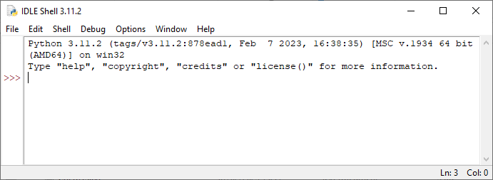
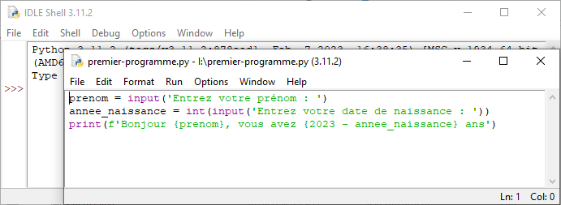
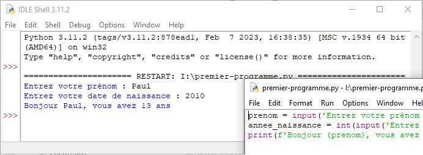
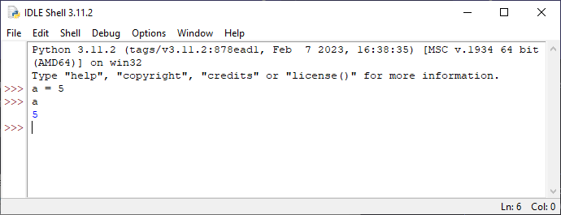
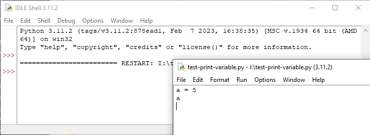
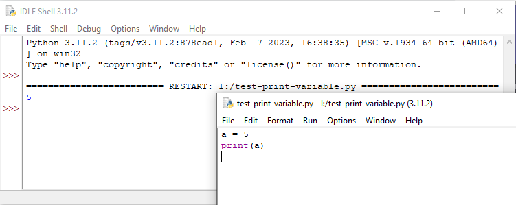

# Instructions

!!! abstract "Cours" 
	Une **instruction** est une commande dont l'exécution fait quelque chose.  
	
	Une **séquence** est une suite d’instructions.

:warning: Attention à ne pas confondre une instruction avec une [expression](2-operations-comparaisons-expressions.md#expressions) dont l'évaluation donne une valeur.

Par exemple :

- `a = 2` est une instruction qui affecte la valeur `2` à la variable `a`.
- `print('Hello world')` est une instruction qui affiche la chaine  `'Hello world'` dans la console.
- `a == 2` n'est pas une instruction, c'est une expression qui compare la valeur de `a` à `2`, la valeur de cette expression est `True` ou `False`.

## `type()`
La fonction `type()` permet de connaitre le type d’une variable.[^3.1]

[^3.1]: Nous n’abordons pas la notion de classe ici.

!!! tip inline end "PEP 8" 
    Pas d’espace avant et à l’intérieur des parenthèses d’une fonction.

``` py
>>> x = 2
>>> type(x)
<class 'int'>
>>> y = 2.0
>>> type(y)
<class 'float'>
>>> z = '2'
>>> type(z)
<class 'str'>
```

## Conversion de type

Les fonctions suivantes permettent de convertir une variable d’un type à un autre :

|fonction|description|exemple|
|---|---|---|
|`int()`|Convertit une chaine de caractères ou un flottant en entier.|`>>> int(2.8)`<br>`2`<br>`>>> int('2')`<br>`2`|
|`float()`|Convertit une chaine de caractères ou un entier en flottant.|`>> float(5)`<br>`5.0`<br>`>>> float('5.5')`<br>`5.5`|
|`str()`|Convertit un entier ou un flottant en une chaine de caractères.|`>>> str(5.5)`<br>`'5.5'`|

	
Observons dans la console comment une variable de type `float` qui a une valeur entière est affiché avec un point :

``` py
>>> a = 5
>>> a
5
>>> float(a)
5.0
```

## Instructions d’entrée et sortie

!!! abstract "Cours" 
	Une instruction d’**entrée** permet à un programme de lire une valeur saisie au clavier par l’utilisateur. Une instruction de **sortie** affiche un message sur l’écran de l'utilisateur.

En Python, la fonction `input()` permet d’écrire une instruction d’entrée qui affecte la valeur saisie par l’utilisateur à une variable. 
``` py
>>> saisie = input('Saisir un message')
>>> saisie
'abc'
```
La valeur renvoyée par `input()` est toujours du type `str` :
``` py
>>> nombre_entier = input('Entrez un nombre entier')
>>> nombre_entier
'25'
```
Ici la valeur affectée à `nombre_entier` est une chaine de caractères : `'25'`. Pour obtenir un nombre, de type `int` ou `float`, afin de faire des calculs par la suite par exemple, il faut la convertir :

``` py
>>> nombre_entier = int(input('Entrez un nombre entier'))
>>> nombre_entier
25
```
> Si l’utilisateur ne saisit pas un nombre entier, cette instruction génère un message d’erreur.

Une instruction de sortie s’écrit en utilisant `print()` pour afficher à l’écran des chaines de caractère et/ou des variables, séparés par des virgules. 

!!! tip inline end "PEP 8" 
    Un espace après une virgule (`,`), mais pas avant.


``` py
>>> print('Hello')
Hello
>>> message='world'
>>> print('Hello', message)
Hello world
>>> nombre = 5
>>> print(nombre)
5
>>> print('le nombre est', nombre)
le nombre est 5
>>> a = 5
>>> b = 6
>>> print('la somme de', a, 'et de', b, 'est', a + b)
la somme de 5 et de 6 est 11
```

Par défaut, `print()` provoque un retour à la ligne après chaque affichage. Pour changer ce comportement il faut préciser la fin de l’affichage en ajoutant un paramètre `end=` suivi d'une chaine de caractères, par exemple un espace `end=' '` ou même une chaine vide `end=''`. 

``` py
>>> print('Hello', end=' ')
Hello >>>
```

Python 3.6 a introduit les chaine de caractères f-strings (*formatted string*) qui s’écrivent avec `f` devant et permettent d’y insérer des variables, ou même des expressions, entre accolades. 
``` py
>>> prenom = 'Paul'
>>> annee_naissance = 2010
>>> print(f'Bonjour {prenom}, vous avez {2023 - annee_naissance} ans')
Votre nom est un Paul et vous avez 13 ans
```

## Premier programme

Pour permettre à l'utilisateur d'entrer son prénom et sa date de naissance et d'affecter ses réponses aux variables `prenom` et `annee_naissance`, il faut à chaque fois écrire dans la console les instructions suivantes :
``` py
>>> prenom = input('Entrez votre prénom : ')
Entrez votre prénom : Paul
>>> annee_naissance = int(input('Entrez votre date de naissance : '))
Entrez votre date de naissance : 2010
>>> print(f'Bonjour {prenom}, vous avez {2023 - annee_naissance} ans')
Bonjour Paul, vous avez 13 ans
>>> 
```
Cette séquence montre les limites de la console, qui répond à des commandes de façon interactive, mais ne permet pas d'écrire un programme élaboré !

Ouvrons IDLE (/python/Lib/idlelib/idle.bat) pour écrire un premier programme, l'interpréteur de commande avec l'invite Python `>>>` apparaît :

!!! note inline end "" 
	Python propose par défaut un **IDE** (pour *Integrated Development Environment*) appelé IDLE. Il existe de nombreux IDE, certains dédiés à Python comme PyScripter, Thonny, etc. et d'autres généralistes comme VS Codium, VS Code, etc. acceptant plusieurs langages informatiques.

{ width="60%" }

Ouvrons un nouveau fichier avec le menu `File/New` pour entrer le programme Python suivant : 
``` py
prenom = input('Entrez votre prénom : ')
annee_naissance = int(input('Entrez votre date de naissance : '))
print(f'Bonjour {prenom}, vous avez {2023 - annee_naissance} ans')
```

{ width="60%" }

Enregistrons le programme dans nos fichiers avec le menu `File/Save As` puis `Run/Run Module` pour exécuter le programme. Le résultat est affiché dans la console :

{ width="60%" }

Nous avons écrit notre premier programme informatique !


Notons au passage une différence importante entre l'affichage d'une variable depuis la console et depuis un programme :
=== "Depuis la console"
   
	Il suffit de saisir le nom de la variable à l'invite de commande pour afficher sa valeur :
	``` py
	>>> a = 5
	>>> a
	5
	```
    { width="80%" }

=== "Depuis un programme"
    
    Le programme suivant n'affiche rien dans la console :
	``` py linenums="1"
	a = 5
	a
	```
	{ width="80%" }


=== "Depuis un programme avec print()"
    
    Il faut utiliser l'instruction `print()` dans un programme pour afficher la valeur d'une variable dans la console.
	``` py linenums="1"
	a = 5
	print(a)
	```
	{ width="80%" }


!!! question "Exercice corrigé" 
	Pour passer d’un pixel couleur codé RGB (mélange des trois couleurs rouge, vert, bleu) à un pixel en nuance de gris, on utilise la formule suivante qui donne le niveau de gris :
	$G = 0,11 \times R + 0,83 \times V + 0,06 \times B$ où $R$, $V$ et $B$ sont les niveaux de rouge, vert et bleu.

	Ecrire le programme qui demande en entrée les 3 couleurs d’un pixel et affiche en sortie la nuance de gris.

??? Success "Réponse"
	Quelques questions à se poser avant d'écrire le programme demandé :

	- Quelles sont les informations à saisir par l'utilisateur ? Les trois niveaux de couleurs $R$, $V$ et $B$.
	- Où stocker ces informations ? Dans trois variables de type `int` nommées par exemple `R`, `V` et `B` comme dans la formule.
	- Que doit calculer le programme ? Le niveau de gris calculé en utilisant la formule et stocké dans une variable, nommée par exemple `G`, de type `int`.
	- Que doit faire ensuite le programme ? Le programme doit afficher le niveau de gris.

	Traduit en Python, le programme s'écrit simplement :

	!!! note inline end "" 
		Noter la présence de commentaires dans le code, commençant par le signe `#`, ils sont ignorés par l'interpréteur Python.

	!!! note inline end "" 
		Essayer le programme sans faire la conversion des variables `R`, `V` et `B` en `int` et constater l’erreur produite.
	
	``` py linenums="1"
	# Demande les 3 couleurs R, V et B de type int
	R = int(input('Rouge:'))
	V = int(input('Vert:'))
	B = int(input('Bleu:'))
	# Calcule le niveau de gris G, de type int
	G = int(0.11 * R + 0.83 * V + 0.06 * B)
	# Affiche le niveau de gris
	print(f'Le niveau de Gris est {G}')
	```
