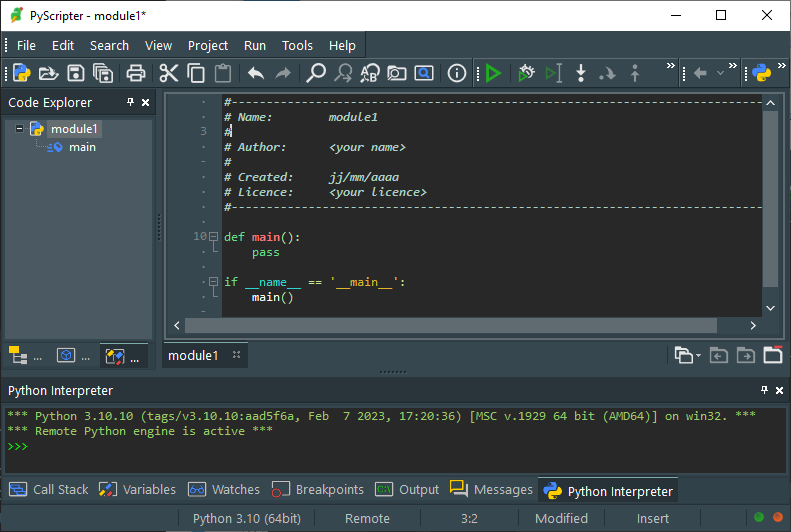

# Appel de fonctions

Nous avons déjà utilisé des fonctions comme `print()` ou `len()` qui sont des fonctions prédéfinies par Python. Un programme utilise beaucoup de ces fonctions Python, mais il est aussi souvent très utile de créer nos propres fonctions, ce qui présente de nombreux avantages :

!!! note inline end "" 
    Noter ici la différence avec une fonction mathématique.

- Modularité : Les fonctions permettent de découper un programme en petites parties indépendantes, ce qui facilite la lisibilité et la résolution de problèmes complexes.

- Réutilisabilité : Une fois qu'une fonction est définie, elle peut être appelée plusieurs fois sans avoir à réécrire le même bloc de code à chaque fois. 

- Testabilité : Les fonctions sont des séquences isolées de code qui peuvent être testées individuellement.


!!! abstract "Cours" 
    Une fonction est définie (ou « déclarée ») par :

    - le mot réservé `def` (pour *define*),
    - son nom,
    - zéro, un ou plusieurs paramètres écrits entre parenthèses (les parenthèses sont obligatoires même quand il n'y a pas de paramètres) et séparés par des virgules,
    - deux-points `:`,
    - une séquence d'instructions indentées (le « corps » de la fonction).
    
    ``` py
    def nom_dela_fonction(param1, param2, ...):
        instructions
    ```


Comme pour les noms de variables, le nom d'une fonction :

- s'écrit en lettres minuscules (« `a` » à « `z` ») et majuscules (« `A` » à « `Z` ») et peut contenir des chiffres (« `0` » à « `9` ») et le caractère blanc souligné (« `_` ») ;

- ne doit pas comporter d'espace, de signes d'opération « `+` », « `-` », « `*` » ou « `/` », ni de caractères spéciaux comme des signes de ponctuation « `'` », « `"` », « `,` », « `.` », « `:` », « `@` », etc.  ;

- ne doit pas commencer par un chiffre ;

- ne doit pas être un mot réservé de Python, par exemple « `for` », « `if` », « `print` », etc. ; et

- est sensible à la casse, ce qui signifie que les fonctions « `TesT` », « `test` » ou « `TEST` » sont différentes.


De la même façon que dans les constructions élémentaires vues précédemment (`if-else`, `while`, `for`), c'est l'indentation qui suit les deux-points qui détermine le bloc d'instructions qui forment la fonction.

Lorsqu'une fonction est définie dans un programme, elle ne s'exécute pas automatiquement.  Et ceci même si la fonction comporte une erreur, l'interpréteur Python ne s'en aperçoit pas.

=== "Programme 1"

    La fonction `bonjour` n'est pas appelée, ce programme ne fait rien.

    ``` py linenums="1"
    def bonjour():
        print('hello')
    ```
    
=== "Programme 2" 

    La fonction `bonjour` n'est pas appelée, ce programme ne fait rien, même s'il y une erreur, :bug: il manque des apostrophes ou des guillemets autour de `'hello'`.

    ``` py linenums="1"
    def bonjour():
        print(hello)
    ```

Définir une fonction consiste simplement à décrire son comportement et à lui donner un nom. Pour exécuter la fonction, il faut l'**appeler** depuis un programme ou depuis la console Python en écrivant son nom suivi des parenthèse. 

!!! note inline end "" 
    :warning: Quand la fonction n'a pas de paramètres, il faut quand même mettre les parenthèses pour l'appeller.

=== "Depuis la console"
    ``` py linenums="1"
    def bonjour():
        print('hello')
    ```

    Ici le programme définit une fonction mais ne l'appelle pas. Elle peut être appelée depuis la console :

    ``` py
    >>> bonjour()
    hello
    ```

=== "Depuis un programme"
    ``` py linenums="1"
    def bonjour():
        print('hello')
    
    bonjour()
    ```

    Ici le programme définit une fonction et l'appelle immédiatement. Quand le programme est exécuté, il affiche dans la console :
    ``` py
    hello
    ```


Il faut définir une fonction **avant** de l'appeler. Ces deux programmes affichent un message d'erreur :

=== "Programme 1"
    
    ``` py linenums="1"
    bonjour()

    def bonjour():
        print('hello')
    ```
    La fonction `bonjour` est appelée avant d'être définie, le programme affiche un message d'erreur :
    
    ```
    Traceback (most recent call last):
      File "<string>", line 1, in <module>
    NameError: name 'bonjour' is not defined
    ```

=== "Programme 2"

    ``` py linenums="1"
    def main():
        bonjour()
    
    if __name__ == '__main__':
        main()
    
    def bonjour():
        print('hello')
    ```

    La fonction `bonjour` est appelée avant d'être définie, le programme affiche un message d'erreur :
    
    ```
    Traceback (most recent call last):
      File "<module1>", line 5, in <module>
      File "<module1>", line 2, in main
    NameError: name 'bonjour' is not defined
    ```

## La fonction `main()`

{width="50%" align=right}

PyScripter, comme d'autres IDE (*Integrated Development Environment*), génère automatiquement une fonction appelée `main` avec le code suivant :

``` py linenums="1"
def main():
    pass

if __name__ == '__main__':
    main()
```

En Python, comme dans la plupart des langages de programmation, il y a une fonction principale, appelée souvent `main()`. Elle sert de point de départ de l'exécution d'un programme. 

L'interpréteur Python exécute tout programme linéairement de haut en bas, donc il n'est pas indispensable de définir cette fonction `main()` dans chaque programme, mais il est recommandé de le faire dans un long programme découpés en plusieurs fonctions afin de mieux comprendre son fonctionnement.


##	Paramètres et arguments 

!!! abstract "Cours"
    Même si dans la pratique les deux termes sont souvent confondus par abus de langage, il faut faire la différence entre : 

    - Les **paramètres** (ou paramètres formels) d'une fonction sont des noms de variables écrits entre parenthèses après le nom de la fonction qui sont utilisées par la fonction.

    - Les **arguments** (ou paramètres réels) sont les valeurs qui sont données aux paramètres lorsque la fonction est appelée. 


    On appelle une fonction en écrivant son nom suivi des arguments entre parenthèses.

Prenons en exemple une fonction simple :

``` py linenums="1"  
def bonjour(prenom1, prenom2):
    print('hello', prenom1, 'and', prenom2)

bonjour('Tom', 'Lea')
```

La fonction `bonjour` est définie en ligne 1 par « `def bonjour(prenom1, prenom2):` » avec deux  **paramètres** `prenom1` et `prenom2`. Elle est ensuite appelée à la ligne 4, `bonjour('Tom', 'Lea')`,  en lui passant les **arguments** `'Tom'` et `'Lea'`,  ce sont les valeurs que prennent les deux paramètres `prenom1` et `prenom2` pendant l'exécution de la fonction.

`prenom1` prend la valeur du premier argument quand on appelle cette fonction `bonjour` et `prenom2` la valeur du deuxième. `prenom1`et `prenom2` sont appelés des **paramètres positionnels** (en anglais *positional arguments*). Il est  **obligatoire** de leur donner une valeur quand on appelle une fonction. Par défaut, les paramètres prennent les valeurs des arguments **dans l'ordre de leurs positions respectives**, dans l'exemple ci-dessus `prenom1` prend la valeur `'Tom'`  et `prenom2` la valeur `'Lea'`, comme indiqué par leur position.

Néanmoins il est possible de changer l'ordre des arguments en précisant le nom du paramètre auquel chacun correspond. Par exemple, ces deux appels de fonctions sont identiques :

``` py 
>>> bonjour('Tom', 'Lea')
hello Tom and Lea
>>> bonjour(prenom2 = 'Lea', prenom1 = 'Tom')
hello Tom and Lea
```

Dans tous les cas, il faut appeler une fonction avec **suffisament d'arguments pour tous ses paramètres positionnels**, sinon la fonction ne peut pas s'éxécuter et affiche un message d'erreur :bug: :

``` py 
>>> bonjour('Tom')
Traceback (most recent call last):
  File "<interactive input>", line 1, in <module>
TypeError: bonjour() missing 1 required positional argument: 'prenom2'
```

En plus des paramètres positionnels qui sont obligatoires, il existe des paramètres qui sont facultatifs ayant une valeur d'argument par défaut s'il ne sont pas renseignés, c'est-à-dire la valeur que prendra un paramètre si la fonction est appelée sans argument correspondant. 

!!! tip inline end "PEP 8"  
    Pas d'espace autour du égal (`=`) dans le cas des arguments par mot-clé (à la différence de l'affectation où ils sont recommandés). 

``` py linenums="1"
def bonjour(prenom1, prenom2='Lisa'):
    print('hello', prenom1, 'and', prenom2)

--- Exemple d‘appel dans l‘interpreteur-----------------
>>> bonjour('Tom')
hello Tom and Lisa
```

Ici, lorsque la fonction est définie à la ligne 1 par « `def bonjour(prenom1, prenom2='Lisa'):` », la valeur de `prenom2` est `'Lisa'` par défaut, c'est la valeur qui est utilisée par la fonction quand elle est appelée sans argument correspondant.  `prenom2` est appelé un **paramètre par mot-clé** (en anglais *keyword argument*). Le passage d'un tel argument lors de l'appel de la fonction est **facultatif**.[^5.1]

[^5.1]: Nous avons déjà utilisé une fonction avec un paramètre facultatif par mot-clé avec `end=''` dans `print('hello', end='')`.

Comme les paramètres positionnels, il est possible de changer l'ordre des arguments en précisant le nom du paramètre auquel chacun correspond. 


Prenons l'exemple d'une fonction avec un paramètre positionnel (obligatoire) et deux paramètres (facultatifs) :

``` py
def bonjour(prenom1, prenom2='Lisa', prenom3='Zoe'):
    print('hello', prenom1, ',', prenom2, 'and', prenom3)
```

et comparons plusieurs appels de la fonction :

=== "Appel 1"

    La fonction est appelée avec trois arguments sans mot-clé, ils sont pris dans l'ordre.

    ``` py
    >>> bonjour("Tom", "Lea", "Jean")
    hello Tom , Lea and Jean
    ```


=== "Appel 2"

    La fonction est appelée sans arguments alors qu'elle a un paramètre positionnel obligatoire, il y a une erreur : bug:.

    ``` py
    >>> bonjour()
    Traceback (most recent call last):
      File "<interactive input>", line 1, in <module>
    TypeError: bonjour() missing 1 required positional argument: 'prenom1'
    ```

=== "Appel 3"

    La fonction est appelée avec deux arguments sans mot-clé, ils sont pris dans l'ordre. Le troisième paramètre utilise la valeur par défaut.

    ``` py
    >>> bonjour("Tom", "Lea")
    hello Tom , Lea and Zoe
    ```

=== "Appel 4"

    La fonction est appelée avec deux arguments, le premier est positionnel, le second correspondant au mot-clé du troisième paramètre. Le deuxième paramètre utilise la valeur par défaut.

    ``` py
    >>> bonjour("Tom", prenom3="Lea")
    hello Tom , Lisa and Lea
    ```


=== "Appel 5"

    La fonction est appelée avec les deux arguments par mot-clé, mais il manque l'argument postionnel obligatoire, il y a une erreur : bug:

    ``` py
    >>> bonjour(prenom2="Jean", prenom3="Lea")
    Traceback (most recent call last):
      File "<interactive input>", line 1, in <module>
    TypeError: bonjour() missing 1 required positional argument: 'prenom1'
    ```


=== "Appel 6"

    La fonction est appelée avec deux arguments, le premier corresponant au mot-clé du troisième paramètre et le second correspond au paramètre positionnel. Il y a une erreur car les paramètres positionnels doivent être placés avant.


    ``` py
    >>> bonjour(prenom3="Lea", "Tom")
    File "<interactive input>", line 1
    bonjour(prenom3="Lea", "Tom")
                                ^
    SyntaxError: positional argument follows keyword argument
    ```


=== "Appel 7"

    La fonction est appelée avec deux arguments, le premier corresponant au mot-clé du troisième paramètre et le second correspond au paramètre positionnel identifié par son mot-clé. Le deuxième paramètre utilise la valeur par défaut.

    ``` py
    >>> bonjour(prenom3="Lea", prenom1="Tom")
    hello Tom , Lisa and Lea
    ```


À noter : 
> Si une fonction est définie avec des paramètres positionnels et des paramètres par mot-clé, les paramètres positionnels doivent toujours être placés avant les paramètres par mot-clé : Ecrire «`def bonjour (prenom1='Tim', prenom2):`» :bug: est incorrect.


##	L'instruction `return`

Prenons l'exemple d'une fonction très pratique, `prix` qui permet d'afficher un prix en ajoutant la TVA. Cette fonction a deux paramètres, `prix_ht` le prix hors taxe d'un bien et `tva` le taux de TVA exprimé en pourcent et qui vaut `20` par défaut :

``` py
def prix(prix_ht, tva=20):
    prix_ttc = prix_ht * (1 + tva/100)
    print(prix_ttc)

```
Comment afficher le prix d'un article de 100 euros avec 5% de TVA ? C'est très simple, il suffit de l'appeler :

``` py
>>> prix(100, 5)
105.0
```

Mais comment afficher le prix total de plusieurs articles avec des taux de tva différents ? Par exemple un panier contenant un article de 100 euros à 5% de TVA et un autre article de 50 euros à 20% de TVA ? 

``` py
>>> prix(100, 5) + prix(50)
105.0
60.0
Traceback (most recent call last):
  File "<interactive input>", line 1, in <module>
TypeError: unsupported operand type(s) for +: 'NoneType' and 'NoneType'
```

Impossible de faire la somme des prix des deux articles ! Cette fonction montre très rapidement ses limites. 

Plutôt que d'afficher le prix calculé, il est plus judicieux de le **renvoyer**.

!!! note inline end "" 
    Il n'y a pas de parenthèse à l'instuction `return`.

``` py
def prix(prix_ht, tva=20):
    prix_ttc = prix_ht * (1 + tva/100)
    return prix_ttc
```
et d'afficher les prix qui nous intéressent :

``` py
>>> prix(100, 5)
105.0
>>> prix(100, 5) + prix(50)
165
```


Voyons plus en détail la différence entre les deux fonctions avec `print()` et `return`. 

=== "Fonction avec `print()`"
    ``` py 
    def prix(prix_ht, tva=20):
        prix_ttc = prix_ht * (1 + tva/100)
        print(prix_ttc)
    ```

=== "Fonction avec `return`"
    ``` py 
    def prix(prix_ht, tva=20):
        prix_ttc = prix_ht * (1 + tva/100)
        return prix_ttc
    ```

Elles affichent toutes les deux le même résultat quand elles sont appelées dans la console :

``` py
>>> prix(100, 5)
105.0
```

Alors quelle est la différence ? Elle apparaît immédiatement si on appelle la fonction depuis le programme avec `prix(100, 5)`:

=== "Fonction avec `print()`"
    ``` py 
    def prix(prix_ht, tva=20):
        prix_ttc = prix_ht * (1 + tva/100)
        print(prix_ttc)

    prix(100, 5)
    ```
    Le programme affiche `105`.

=== "Fonction avec `return`"
    ``` py 
    def prix(prix_ht, tva=20):
        prix_ttc = prix_ht * (1 + tva/100)
        return prix_ttc
    
    prix(100, 5)
    ```
    Le programme n'affiche rien.

Et si on essaye d'appeller la fonction depuis le programme avec `print(prix(100, 5))`:

=== "Fonction avec `print()`"
    ``` py 
    def prix(prix_ht, tva=20):
        prix_ttc = prix_ht * (1 + tva/100)
        print(prix_ttc)

    print(prix(100, 5))
    ```
    Le programme affiche `105` quand `print(prix_ttc)` s'exécute puis `None` quand `print(prix(100, 5))` s'exécute.

=== "Fonction avec `return`"
    ``` py 
    def prix(prix_ht, tva=20):
        prix_ttc = prix_ht * (1 + tva/100)
        return prix_ttc
    
    print(prix(100, 5))
    ```
    Le programme affiche `105` quand `print(prix(100, 5))` s'exécute.


- Avec `print()` la première fonction `prix`  **affiche** le résultat calculé dans la console mais ce résultat n'est plus utilisable dans la suite du programme, il est perdu ;

- par contre, avec `return` la seconde fonction  **renvoie** le résultat calculé qui peut être utilisé par exemple pour faire d'autres opérations, pour l'affecter à une variable, ou encore comme argument d'une autre fonction, voire même pour être tout simplement affiché comme par exemple `print(prix(100, 5))`. 


Appelons `prix(100, 5)` et essayons d'affecter la valeur renvoyée par ces deux fonctions à une variable :

=== "Fonction avec `print()`"
    
    ``` py 
    def prix(prix_ht, tva=20):
        prix_ttc = prix_ht * (1 + tva/100)
        print(prix_ttc)

    p = prix(100, 5)
    ```
    Dans ce cas la variable `p` a la valeur `None`, :bug: ce n'est probablement pas ce qui était attendu !

=== "Fonction avec `return`"
    ``` py 
    def prix(prix_ht, tva=20):
        prix_ttc = prix_ht * (1 + tva/100)
        return prix_ttc

    p = prix(100, 5)
    ```
	Dans ce cas la variable `p` a bien la valeur `105` comme attendu.
	
	
Dans le doute, de façon générale, il faut éviter d'afficher un résultat avec `print()` dans une fonction autre que la fonction `main()` et préfèrer renvoyer le résultat avec `return`.

Un autre point important à noter est qu'une fonction se termine immédiatement dès qu'une instruction `return` est exécutée. 

Par exemple dans la fonction `plus_petit(a, b)` suivante[^5.2], qui renvoie le plus petit de deux nombres `a` et `b` :

[^5.2]: La fonction `min()` existe dans Python.

``` py linenums="1" 
def plus_petit(a, b): 
    if a < b:
        return a
    else: 
        return b
```     

le `else` en ligne 4 est inutile. On peut simplement écrire : 
``` py linenums="1" 
def plus_petit(a, b): 
    if a < b:
        return a
    return b
```     
En effet, si `a` est plus petit que `b`, la fonction se termine à la ligne 3 et le dernier `return b` ne sera jamais exécuté.

Pour finir, Une fonction peut aussi renvoyer plusieurs valeurs en même temps, séparées par des virgules, par exemple la fonction `carre_cube(x)` suivante renvoie le carré le cube d'un nombre `x` : 

``` py 
def carre_cube(x):
   return x**2, x**3

print(carre_cube(5))
```

affiche `(25, 125)`.


!!! abstract "Cours"
    !!! note inline end "" 
        Le verbe "renvoyer" est préféré à "retourner" (anglicisme pour *return*).

    Une fonction peut **renvoyer** une ou plusieurs valeurs avec l'instruction **`return`**.
        
    La fonction se termine immédiatement dès qu'une instruction `return` est exécutée. Les instructions suivantes sont ignorées.


À noter :
> S'il n'a pas d'instruction `return` dans une fonction, elle renvoie `None`[^5.3]. 

[^5.3]: Une fonction qui renvoie `None` (ou qui ne renvoie rien dans d'autres langages) est appelée une procédure.


!!! question "Exercice corrigé" 
	Écrire une fonction `est_premier(nombre)` qui renvoie `True` si `nombre` est un nomber premier et `False` sinon.

    Rappel : un nombre est premier s'il n'a que deux diviseurs, 1 et lui-même.


??? Success "Aide"
    Le fait qu'une fonction se termine immédiatement après une instruction `return` est bien utile dans ce cas.  
    Pour vérifier si `nombre` est premier, il suffit de tester tous les entiers entre `2` et `n-1` les uns après les autres pour trouver un diviseur autre que `1` et `nombre`.  Dès qu'un diviseur est trouvé, inutile de continuer, le nombre n'est pas premier et dans ce cas l'instruction `return False` termine la fonction. Si aucun diviseur n'est trouvé après les avoir tous testés, la fonction se termine en renvoyant `True`.


??? Success "Réponse"


    === "Avec une boucle `for` en testant les entiers allant de 2 à `nombre` (exclus)"
        ``` py linenums="1"
        def est_premier(nombre):
            # Cherche un diviseur entre 2 et nombre-1
            for div in range(2, nombre):
                if nombre % div == 0:
                    return False    # div est un diviseur, nombre n'est pas premier, la fonction se termine et renvoie False
            return True   # si aucun diviseur n'a été trouvé alors le nombre est premier, la fonction renvoie True
        ```

    === "Avec une boucle `while` en testant les entiers allent de 2 à la racine carrée du nombre"
        ``` py linenums="1"
        def est_premier(nombre):
            div = 2
            # Cherche un diviseur entre 2 et la racine carré de nombre
            while div**2 <= nombre:
                if nombre % div == 0:
                    return False   # div est un diviseur, nombre n'est pas premier, la fonction se termine et renvoie False
                div = div + 1    # essayons le suivant
            return True   # si aucun diviseur n'a été trouvé alors le nombre est premier, la fonction renvoie True

        ```

    Appelons la fonction `estpremier `avec les arguments 13 et 21 :

    === "Appel `estpremier(13)`"
        `div` prend les valeurs `2`, `3`, etc. et aucune de ces valeurs n'est un diviseur de `13`, l'instruction conditionnelle `nombre % div == 0` n'est jamais vérifiée, la boucle se termine et la dernière instruction `return True` est exécutée, la fonction se termine.
        
        ``` py 
        >>> estpremier(13)
        True
        ```

    === "Appel `estpremier(21)`"
        `div` prend la valeur `2`, ce n'est pas un diviseur de `21` (`21 % 2` est égal à 1), la boucle continue.
        `div` prend la valeur `3`, c'est pas un diviseur de `21` (`21 % 3` est égal à 0), l'instruction conditionnelle `nombre % div == 0` est vérifiée, donc l'instruction `return False` est exécutée et la fonction se termine, la dernière instruction `return True` n'est jamais exécutée.

        ``` py 
        >>> estpremier(21)
        False
        ```


        
##	Fonction lambda

!!! abstract "Cours"
    En Python, les fonctions lambda sont des fonctions extrêmement courtes, limitées à une seule expression, sans utiliser le mot-clé `def`.  
    ``` py 
    nom_de_fonction = lambda param1, param2,…: expression
    ```

Prenons par exemple une fonction qui ajoute deux valeurs :
``` py
>>> somme = lambda x, y: x + y
>>> somme(3, 5)
8
```

Ici la fonction lambda est définie par l'expression `lambda x, y: x + y` qui comporte :

- le mot réservé `lambda`,
- suivi de deux paramètres `x` et `y` placés avant les deux-points,
- deux-points `:`,
- l'expression de la valeur renvoyée `x + y`, placée après les deux-points.

Le signe `=` affecte cette fonction à une variable, ici `somme`, c'est le nom de cette fonction.

 L'instruction `somme(3, 5)` permet ensuite d'appeler la fonction avec deux arguments `3` et `5`.


!!! question "Exercice corrigé" 
	Écrire la fonction cube qui renvoie le cube d'un nombre sous formes classique et lambda.

??? Success "Réponse"
    ``` py 
    def cube(y): 
       return y**3
    ```
    et 

    ``` py 
    cube = lambda y: y**3 
    ```


Réduite à une seule expression, les fonctions lambda permettent d'utiliser une instruction conditionnelle écrite sous une forme un peu différente que [vue précedemment](4-constructions-elementaires.md#instructions-conditionnelles) : 

``` py
>>> entre_10_et_20 = lambda x: True if (x > 10 and x < 20) else False                     
>>> entre_10_et_20(5)
False
```
 
##	Portée de variables

!!! abstract "Cours"
    La **portée** d'une variable désigne les endroits du programme où cette variable **existe et peut être utilisée**. En Python, la portée d'une variable commence dès sa première affectation.

Exemple : Les programmes suivants affichent un message d'erreur

=== "Programme 1"
    ``` py 
    print(a)
    a = 1
    ```
    Ce programme essaie d'afficher la variable `a` avant qu'elle ne soit définie, il affiche un message d'erreur :

    ```
    >>>
    Traceback (most recent call last):
    File "<module1>", line 1, in <module>
    NameError: name 'a' is not defined
    ```

=== "Programme 2"
    ``` py 
    a = a + 1
    print(a)
    ```
    Ce programme essaie d'affecter à la variable `a` une valeur calculée en utilisant `a` avant qu'elle ne soit définie, il affiche un message d'erreur :

    ```
    >>>
    Traceback (most recent call last):
    File "<module1>", line 1, in <module>
    NameError: name 'a' is not defined
    ```


###	Variables locales

!!! abstract "Cours"
    Une variable définie à l'intérieur d'une fonction est appelée **variable locale**. Elle ne peut être utilisée que localement c'est-à-dire qu'à l'intérieur de la fonction qui l'a définie. 

Tenter d'utiliser une variable locale depuis l'extérieur de la fonction qui l'a définie provoquera une erreur. 

Exemple : 

``` py
def affiche_a():
    a = 1
    print(f'valeur de a dans affiche_a : {a}')

affiche_a()
print(f'valeur de a dans le programme : {a}')
```
La variable `a` elle est locale à `affiche_a`, le programme suivant affiche un message d'erreur :

```
>>>
Traceback (most recent call last):
  File "<module1>", line 6, in <module>
NameError: name 'a' is not defined
```

###	Paramètres passés par valeur

Dans les exemples précédents (`est_premier(13`), etc.), les arguments utilisés en appelant les fonctions étaient des valeurs. 

Les arguments utilisés dans l'appel d'une fonction peuvent aussi être des variables ou même des expressions. Les trois appels de fonctions suivants font le même chose :


``` py 
>>> est_premier(13)
True
>>> a = 13
>>> est_premier(a)
True
>>> nombre = 6
>>> est_premier(2*nombre + 1)
True
```

Quand un argument de fonction est une variable (ou une expression contenant une variable), par exemple dans le cas de `est_premier(a)`, c'est la valeur de cette variable (ou de cette expression) qui est passée au paramètre correspondant de la fonction. On dit que le paramètre est « passé par valeur ». Des modifications éventuelles de ce paramètre dans la fonction ne modifient pas la valeur de la variable qui a servit d'argument à la fonction. Et c'est le cas même quand le nom de la variable est identique au nom du paramètre de la fonction, c'est seulement sa valeur qui est passée à la fonction. 

!!! abstract "Cours"
    Une fonction ne peut pas modifier la valeur d'une variable passée en paramètre en dehors de son exécution.  **Les paramètres sont passés par valeur**.

Exemple :
``` py 
def ajoute_1(a):
    a = a + 1
    print(f'valeur de a dans ajoute_1 : {a}')

a = 1
ajoute_1(a)
print(f'valeur de a dans le programme : {a}')
```

La valeur de a est modifiée en `2` à l'intérieur de la fonction `ajoute_1` pendant son exécution, mais pas dans le programme où elle garde sa valeur initiale de  `1`.

```
>>> 
valeur de a dans ajoute_1 : 2
valeur de a dans le programme : 1
```
 
###	Variables globales

Sauf exception il est préférable d'utiliser uniquement des variables locales pour faciliter la compréhension des programmes et réduire l'utilisation de mémoire inutile, mais dans certains cas leur portée n'est plus suffisante.

!!! abstract "Cours"
    Une variable définie en dehors de toute fonction est appelée **variable globale**. Elle est utilisable à travers l'ensemble du programme. 

Elle peut être affichée par une fonction :

``` py 
def affiche_a():
    print(f'valeur de a dans affiche_a : {a}')       

a = 1
affiche_a()
```


Mais ne peut pas être modifiée. 

``` py 
def affiche_a():
    a += 1
    print(f'valeur de a dans affiche_a : {a}')

a = 1
affiche_a()

```
Ce programme affiche un message d'erreur :bug: :
```
>>>
Traceback (most recent call last):
  File "<module1>", line 6, in <module>
  File "<module1>", line 2, in affiche_a
UnboundLocalError: local variable 'a' referenced before assignment
```

On peut néanmoins essayer de lui assigner une nouvelle valeur :

``` py 
def affiche_a():
    a = 2
    print(f'valeur de a dans affiche_a : {a}')

a = 1
affiche_a()
print(f'valeur de a dans le programme : {a}')
```

Mais dans ce cas, Python part du principe que `a` est locale à la fonction, et non plus une variable globale. L'instruction `a = 2` a créé un nouvelle variable locale à la fonction, la variable globale n'a pas changé :

```
>>>
valeur de a dans affiche_a : 2
valeur de a dans le programme : 1
```


Dans certaines situations, il serait utile de pouvoir modifier la valeur d'une variable globale dans une fonction et que cette nouvelle valeur soit gardée dans le reste du programme. Pour cela, il faut utiliser le mot clef `global` devant le nom d'une variable globale utilisée localement afin d'indiquer qu'il faut modifier la valeur de la variable globale et non pas créer une variable locale de même nom :

``` py 
def affiche_a():
    global a
    a = 2
    print(f'valeur de a dans affiche_a : {a}')

a = 1
affiche_a()
print(f'valeur de a dans le programme : {a}')
```
La variable `a` a été modifiée dans la fonction et que sa nouvelle valeur est gardée dans le reste du programme :
```
>>>
valeur de a dans affiche_a : 2
valeur de a dans le programme : 2
```

!!! abstract "Cours"
    Une variable globale est accessible uniquement en lecture à l'intérieur des fonctions du programme. Pour la modifier il faut utiliser le mot-clé `global`.

 
##	Fonction récursive

Une fonction peut être appelée n'importe où dans un programme (après sa définition), y compris par elle-même.

!!! abstract "Cours"
    Une fonction récursive est une fonction qui peut s'appeler elle-même au cours de son exécution.

Prenons pour exemple une fonction qui renvoie le produit de tous les nombres entiers entre 1 et $n$. Ce produit est appelé factorielle de $n$ et noté $n!$.

$n!  =  1  \times 2  \times 3  \times 4  \times ...  \times (n-1)  \times n$ 

Une simple boucle `for` permet de multiplier tous les entiers allant de `1` à `n` :

``` py 
def factorielle(n):
    fact = 1
    for i in range(1, n + 1):
        fact = fact * i
    return fact
```

Mais il est aussi possible de remarquer que $n!  =  (n - 1)!  \times n$ et que $1!  =  1$, ce qui permet d'écrire un programme récursif suivant : 
 
``` py 
def factorielle_recursive(n):
    if n == 1:
        return 1
    else:
        return  factorielle_recursive(n-1) * n         # le else est facultatif
```

:warning: Il est impératif de prévoir une condition d'arrêt à la récursivité, sinon le programme ne s'arrête jamais ! On doit toujours tester en premier la condition d'arrêt, et ensuite, si la condition n'est pas vérifiée, lancer un appel récursif.


!!! question "Exercice corrigé" 
	Écrire une fonction récursive `compte_a_rebours(n)` qui affiche les nombres entiers à rebours allant de `n` à `0`.

??? Success "Réponse"
    ``` py linenums="1"
    def compte_a_rebours(n):
        if n < 0:
            pass
        else:
            print(n)
            compte_a_rebours(n-1)
    ```
    ou plus simplement :  

    ``` py linenums="1"
    def compte_a_rebours(n):
        print(n)
        if n > 0:
            compte_a_rebours(n-1)
    ```
