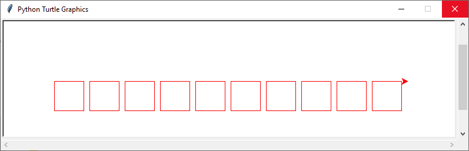

##	Modules et bibliothèques

Nous avons vu dans l'exercice précédent comment écrire un programme qui affiche la décomposition d’un nombre en facteurs premiers en utilisant la fonction `est_premier`. 


``` py linenums="1"
def est_premier(nombre):
    for div in range(2, nombre):
        if nombre % div == 0:
            return False
    return True

def main():
    nombre = int(input('Entrez un nombre '))
    premier = 2 # on commence par le plus petit nombre premier : 2
    while nombre > 1:
        if nombre % premier == 0:      # si premier divise nombre
            print(premier, end=" ")                 # alors on l'affiche
            nombre = nombre // premier     # et on recommence après avoir divisé nombre par premier
        else:                          # sinon, premier n'est pas un diviseur
            premier += 1                 # on cherche le nombre premier suivant
            while not(est_premier(premier)):
                premier += 1


if __name__ == '__main__':
    main()
```

!!! info inline end "Rappel" 
    La fonction `est_premier` doit être est écrite au début du programme, elle doit être définie **avant** d'être appelée.

Ici le programme est écrit dans le même fichier Python que la fonction `est_premier`. Mais se passerait'il si un programme écrit dans un autre fichier Python appelle cette même fonction ? 

Ecrivons un nouveau programme Python qui appelle `est_premier` :

``` py linenums="1"
n = int(input('Entrez un nombre'))
print(est_premier(n)) 
```

Il affiche une erreur :bug: : 
```
Traceback (most recent call last):
  File "<module2>", line 2, in <module>
NameError: name 'est_premier' is not defined
```

Alors comment faire pour appeler `est_premier` depuis ce nouveau programme sans la réécrire ? Il faut créer un module.

Enregistrons la fonction `est_premier` dans un fichier qu’on appelle « mesfonctions.py ». :warning: Le fichier « mesfonctions.py » doit être **enregistré dans le même répertoire** que le nouveau programme. Nous avons créé le module `mesfonctions`.

Testons à nouveau le programme principal. Toujours la même erreur. Le module `mesfonctions` doit d’abord être importé pour utiliser les fonctions qu’il contient.

!!! abstract "Cours"
    Un **module** est un programme Python regroupant des fonctions et des constantes (des variables dont la valeur ne change pas[^6.1]) ayant un rapport entre elles.  
    
    Un module doit être **importé** dans un programme avant de pouvoir utiliser ses fonctions et ses constantes.
    
    Une **bibliothèque** (ou *package* en anglais) regroupe des fonctions, des constantes et des **modules**.

[^6.1]: Par exemple la valeur de $\pi$ dans le module `math`.


## `import`

Pour importer un module dans un programme, il faut utiliser l'instruction `import` en début de programme :

``` py
import mesfonctions
```

Pour appeler une fonction ou utiliser une constante d'un module il faut écrire le nom du module suivi d'un point « . » puis du nom de la fonction ou de la constante.  

``` py linenums="1"
import mesfonctions

n = int(input('Entrez un nombre '))
print(mesfonctions.est_premier(n)) 
```

:warning: Prendre soin d’enregistrer ce programme dans le même répertoire que le fichier « mesfonctions.py ».

Il est aussi possible donner un alias à un module pour le renommer avec un nom plus simple à écrire, par exemple pour utiliser `mf` au lieu de `mesfonctions` :

``` py linenums="1"
import  mesfonctions  as mf

n = int(input('Entrez un nombre '))
print(mf.est_premier(n)) 
```


!!! abstract "Cours"
    === "Sans alias"
        Pour importer un module `nom_module`, il faut écrire en début de programme l’instruction : 

        `import nom_module`	
        
        puis pour utiliser une fonction `nom_fonction()` de ce module  :

        `nom_module.nom_fonction()`

    === "Avec alias"
        Pour importer un module `nom_module` en lui donnant un alias `nom_alias`, il faut écrire en début de programme l’instruction :

        `import nom_module as nom_alias`	
        
        puis pour utiliser une fonction `nom_fonction()` de ce module  :

        `nom_alias_module.nom_fonction()`


La fonction `help()` permet de savoir ce que contient un module :

``` py
>>> help(mesfonctions)
Help on module mesfonctions:
…
```

##	`from … import …`

Il existe une autre méthode pour importer des fonctions ou constantes depuis un module. Admettons que le module `mesfonctions` contienne des dizaines de fonctions, mais que nous ayons uniquement besoin dans notre programme de la fonction `est_premier`, dans ce cas il est préfèrable d'importer uniquement cette fonction plutôt que tout le module en utilisant l'instruction ``from mesfonctions import est_premier`. 

``` py linenums="1"
from  mesfonctions import est_premier

n = int(input('Entrez un nombre '))
print(est_premier(n))
```

À noter : 
> Ici on ne met pas le préfixe « `mesfonctions.` »  devant le nom de la fonction `est_premier`. 


On peut aussi donner un alias à une fonction :
`from mesfonctions import est_premier as estprems`
et utiliser ensuite la fonction `estprems()`.

!!! abstract "Cours"
   
    === "Sans alias"

        Pour importer une fonction `nom_fonction()` depuis le module `nom_module`, il faut écrire en début de programme l’instruction :
        
        `from nom_module import nom_fonction`		
        
        puis pour utiliser cette fonction :
        
        `nom_fonction()`


        
    === "Avec alias"


        Pour importer une fonction `nom_fonction()` en lui donnant un alias `nom_alias` depuis le module `nom_module`, il faut écrire en début de programme l’instruction :
        
        `from nom_module import nom_fonction as nom_alias`		
        
        puis pour utiliser cette fonction :
        
        `nom_alias()`


Il est aussi possible d'importer plusieurs fonctions d’un même module séparées par des virgules :

``` py
from mesfonctions import est_premier, une_autre_fonction
```
voire même toutes les fonctions d'un module en tapant « `*` » à la place du nom de la fonction à importer.

``` py
from mesfonctions import *
```

Mais cette dernière utilisation est vivement déconseillée, hormis dans des cas très particuliers par exemple des programmes très courts, car il peut y avoir des conflits entre des fonctions qui ont le même nom. Pour s’en convaincre, imaginons un programme écrit en utilisant l'instruction `pow(1, 2, 3)` qui fonctionnerait parfaitement jusqu'à ce qu'une modification necessitant le module `math` ajoute l'instruction `from math import *` en début de programme et génère une erreur inattendue [^6.2] là où il n'y en avait pas.

[^6.2]: La fonction standard Python `pow()` prend trois paramètres alors que la fonction `pow()` du module `math` n'en a que deux ! L'import de `from math import *` a importé la seconde fonction probablement à l'insu du programmeur.


Python offre des centaines de modules avec des milliers de fonctions déjà programmées. Il y a différents types de modules :

- ceux que l’on peut faire soi-même (comme `mesfonctions`).
- ceux qui sont inclus dans la bibliothèque standard de Python comme `random` ou `math`,
- ceux que l’on peut rajouter en les installant séparemment comme `numpy` ou `matplotlib`.

##	De l'utilité de la fonction 'main()'

On a vu auparavant la définition de la fonction `main()` contenant le programme principal, suivi du bout de code suivant :

``` py
if __name__ == '__main__':
    main()
```

Cette instruction conditionnelle vérifie si une variable appelée `__name__` est égale à `'__main__'` et dans ce cas exécute la fonction `main()`. 

L’interpréteur Python définit la variable `__name__` selon la manière dont le code est exécuté :

- directement en tant que script, dans ce cas Python affecte `'__main__'` à  `__name__`, l'instruction conditionnelle est vérifiée et la fonction `main()` est appelée ; ou alors 

- en important le code dans un autre script et dans ce cas la fonction `main()` n’est pas appelée.

En bref, la variable `__name__` détermine si le fichier est exécuté directement ou s'il a été importé.[^6.3] 


[^6.3]:
    On peut facilement se convaincre de l’utilité de la fonction `main()` en écrivant le programme qui affiche la décomposition d’un nombre en facteurs premiers sans `main()` dans le fichier « mesfonctions.py » :
    ``` py linenums="1"
    def est_premier(nombre):
        for div in range(2, nombre):
            if nombre % div == 0:
                return False
        return True

    nombre = int(input('Entrez un nombre '))
    premier = 2 # on commence par le plus petit nombre premier : 2
    while nombre > 1:
            if nombre % premier == 0:      # si premier divise nombre
                print(premier, end=" ")                 # alors on l'affiche
                nombre = nombre // premier     # et on recommence après avoir divisé nombre par premier
            else:                          # sinon, premier n'est pas un diviseur
                premier += 1                 # on cherche le nombre premier suivant
                while not(est_premier(premier)):
                    premier += 1
    ```
    Lorsque pour utiliser la fonction `est_premier` le module est importé dans un autre programme avec `import  mesfonctions`, toute la suite du programme de la décomposition d’un nombre en facteurs premiers est exécuté automatiquement.

##	Le module math

Le [module `math`](https://docs.python.org/3/library/math.html) permet d’avoir accès aux fonctions mathématiques, par exemple les fonctions cosinus (`cos`), sinus (`sin`), racine carrée (`sqrt`), le nombre $\pi$ (`pi`), la partie entière (`floor`)[^6.4], etc.

[^6.4]:
    Nous avons déjà vu la fonction `int()` qui semble similaire à `math.floor()`, mais attention aux différences entre les deux.

    === "Avec un `float` positif"
    ``` py
    >>> math.floor(12.5)
    12.0
    >>> int(12.5)
    12
    ```

    === "Avec un `float` négatif"
    ``` py
    >>> math.floor(-12.5)
    -13.0
    >>> int(-12.5)
    -12
    ```


``` py
>>> import math
>>> math.cos(math.pi)             # cosinus d'un angle en radian
-1.0
>>> math.sqrt(25)            # racine carrée
5.0
```


##	Le module random

Le [module `random`](https://docs.python.org/3/library/random.html) permet d’utiliser des fonctions générant des nombres aléatoires. Deux fonctions très utiles sont :  

- `random()` qui renvoie un nombre aléatoire entre 0 et 1, et
- `randint(a, b)` qui renvoie au hasard un nombre entier compris entre `a` et **`b` inclus**.

``` py
>>> from random import random, randint
>>> random()
0.34461947461259612
>>> randint(1, 2)
2
```

##	Le module pyplot

La [bibliothèque `mathplotlib`](https://matplotlib.org/) contient le module `pyplot` (utilisé pour tracer des courbes). Pour importer ce module, l’utilisation d’un alias est particulièrement utile dans ce cas. 

``` py
import matplolib.pyplot as plt
```

`pyplot` permet d'afficher des données sous de [multiples formes](https://matplotlib.org/stable/gallery/index.html). Par exemple pour afficher un point de coordonnées (2, 4 ) sous forme d'une croix verte dans un repère :

``` py
plt.plot(2, 4, 'g+')
plt.show()  
```

##	D’autres modules 

Il y en a beaucoup d’autres, tant dans la nature (https://github.com/search?q=python+module) que dans la bibliothèque standard (http://docs.python.org/3/py-modindex.html),

|module|Description|
|---|---|
|`numpy`|Permet de faire du calcul scientifique.|
|`time`|Fonctions permettant de travailler avec le temps.|
|`turtle`|Fonctions de dessin.|
|`doctest`|Execute des tests ecrits dans la docstring d’une fonction.|

La fonction `dir` permet d’explorer le contenu d’un module :

``` py
>>> import math
>>> dir(math)
['__doc__',
 '__loader__',
 '__name__',
 '__package__',
 '__spec__',
 'acos',
 'acosh',
 'asin',
…
```

En plus de la documentation en ligne, la fonction `help` donne les spécifications d’une fonction.

``` py
>>> help(math.cos)
Help on built-in function cos in module math:

cos(...)
    cos(x)
    
    Return the cosine of x (measured in radians).
```


!!! question "Exercice corrigé" 
	Réaliser le dessins suivant (dix carrés rouges de 50 pixels de coté), à l'aide du module turtle.
    []

??? Success "Réponse"

    ``` py 
    import turtle

    def carre(taille, couleur):
        turtle.pendown()
        turtle.color(couleur)
        for _ in range(4):
            turtle.forward(taille)
            turtle.right(90)
        turtle.penup()

    turtle.penup()
    turtle.goto(-300,0)
    for c in range(10):
        carre(50,'red')
        turtle.forward(60)
    ```
    