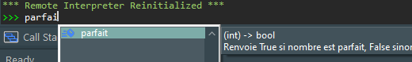

#	Mise au point des programmes et gestion des bugs

Comment s’assurer qu’un programme fasse ce qu’il est censé faire ? Qu’il ne contient pas de bugs ?  Ces questions peuvent devenir extrêmement cruciales et compliquées quand certains  programmes informatiques contiennent des millions de lignes de code, voire des milliards (Google)[^1] ou avoir des défauts de fonctionnements aux conséquences désastreuses  (avionique, nucléaire, médical, etc.). Des solutions existent pour essayer de limiter ces effets néfastes.

[^1]: [https://www.informationisbeautiful.net/visualizations/million-lines-of-code/]( https://www.informationisbeautiful.net/visualizations/million-lines-of-code/)

L’utilisation combinée de **spécifications**, d'**assertions**, de **documentations des programmes** et de **jeux de tests** permettent de limiter (mais pas de garantir ! [^2] ) la présence de bugs dans les programmes.

[^2]: Dans la pratique il n'est pas possible de tester un logiciel dans toutes les conditions qu'il pourrait rencontrer lors de son utilisation et donc pas possible de contrer la totalité des bugs : un logiciel comme Microsoft Word compte 850 commandes et 1 600 fonctions, ce qui fait un total de plus de 500 millions de conditions à tester.

##	Bugs (ou bogues) et exceptions

Il existe de nombreuses causes qui peuvent être à l’origine de bugs dans un programme : oubli d’un cas [^3], typo, dépassement de capacité mémoire[^4], mauvaise communication avec les utilisateurs ou entre programmeurs, etc.

[^3]: En 1996, l'USS Yorktown teste le programme Navy's Smart Ship. Un membre d'équipage rentre un zéro comme valeur lors de manœuvres. Source : [https://en.wikipedia.org/wiki/USS_Yorktown_(CG-48)](https://en.wikipedia.org/wiki/USS_Yorktown_(CG-48))
 

[^4]:  Premier vol d'Ariane 5 en 1996 :  Le code utilisé était celui d'Ariane 4, mais les valeurs d'accélération de la fusée dépassent les valeurs maximales prévues ! Source: [https://fr.wikipedia.org/wiki/Vol_501_d%27Ariane_5](https://fr.wikipedia.org/wiki/Vol_501_d%27Ariane_5)


!!! abstract "Cours"
    Un bug (ou bogue) est une erreur dans un programme à l’origine d’un dysfonctionnement. 

Un bug peut conduire à un résultat qui n’est pas celui attendu, par exemple si `est_premier(5)` renvoyait False, voire même dans certains cas à une exception (mais ce n’est pas toujours le cas). 

!!! abstract "Cours"
    Une exception est une erreur qui se produit pendant l'exécution du programme. Lorsqu'une exception se produit (on dit que l’exception est 'levée'), l'exécution normale du programme est interrompue et l'exception est traitée.


```py
num1, num2 = 7, 0
print(num1/num2)
>>> 
ZeroDivisionError : division by zero
```

Une bonne façon de gérer les exceptions est de se comprendre les différents types d'erreurs qui surviennent et pourquoi elles se produisent. Soyez attentif aux messages d’erreur de l’interpréteur, ils sont d’une grande utilité . Voici ceux que l’on rencontre le plus souvent :

[^5]: RTFM est, en anglais, le sigle de la phrase *Read the fucking manual*, injonction signifiant que la réponse à une question sur le fonctionnement d'un appareil est à chercher dans son mode d'emploi.


-	SyntaxError : une ligne de code non valide empêche le programme de s’exécuter ;
```py
>>> print("Hello World)
  File "<interactive input>", line 1
    print("Hello World)
          ^
SyntaxError: incomplete input
```

-	`IndentationError` : Contrairement à d'autres langages comme Java, C ou C++, qui utilisent des accolades pour séparer les blocs de code, Python utilise l'indentation pour définir la hiérarchie et la structure des blocs de code.
```py
for i in range(10):
print(i)
IndentationError: expected an indented block after 'for' statement on line 1
```

-	`TypeError` : vous essayez d'effectuer une opération en utilisant un type de données incompatible :
```py
>>> "abc" + 2
Traceback (most recent call last):
  File "<interactive input>", line 1, in <module>
TypeError: can only concatenate str (not "int") to str
```

-	`ValueErro`r : une fonction est appelée avec un argument d’une value non autorisée :

```py
>>> int('abc')
ValueError: invalid literal for int() with base 10: 'abc'
```

-	etc.


Pour corriger les bugs et exceptions inévitables lorsqu’on écrit un programme, le débogueur est un outil très utile.

!!! abstract "Cours"
    Le débogueur permet d’effectuer l’exécution ligne par ligne en observant l’évolution du programme et les valeurs des variables.

Pour utiliser le débogueur de PyScripter :

1.	Créer un point d’arrêt sur une ligne (clic sur le numéro de la ligne), ou plusieurs.
2.	Lancer le débogage ( 
    )
 ce qui exécute le script jusqu’au point d’arrêt
3.	Exécuter le script pas à pas tout en inspectant l’évolution des variables dans les onglets Variables ou Watches (surveillances). Pour ajouter une variable à surveiller, cliquer droit dans la fenêtre Watches et ajouter un nom de la variable ou une expression.


##	Commentaires, noms de variables et de fonctions,

Que fait cette fonction?

```py
def f(x):
    a = 0
    for i in range(1, x):
        if x % i == 0:
            a = a + i
    return x == a
```

C’est plus déjà plus lisible avec des noms de fonction et variable qui ont un sens et plutôt que réduits à une lettre.

!!! tip inline end "PEP 8"  
    Ecrire les noms tout en minuscule avec des mots séparés par des blancs soulignés  « _ »  par exemple `nom_de variable` (*snake case*) plutôt que  `NomDeVariable` (*camel case*)

```py
def parfait(nombre):
    somme_diviseurs = 0
    for i in range(1, nombre):
        if nombre % i == 0:
            somme_diviseurs = somme_diviseurs + i
    return nombre == somme_diviseurs 
```

et encore plus lisible avec des commentaires :

```py
def parfait(nombre):
    somme_diviseurs = 0
    # Iterer sur tous les entiers i compris entre 1 et nombre - 1
    for i in range(1, nombre):
        # Si i est un diviseur de nombre on l'ajoute à somme_diviseur
        if nombre % i == 0:
            somme_diviseurs = somme_diviseurs + i
    # Si nombre est egal à la somme de ses diviseurs, c'est un nombre parfait
    return nombre == somme_diviseurs
```

!!! abstract "Cours"
    Les commentaires sont souvent indispensables afin de comprendre et modifier un programme[^6] mais sont ignorés par l’interpréteur Python.

[^6]: Comme le disait Guido van Rossum: “*Code is read much more often than it is written.*”

    ```py
    # Commentaire sur un bloc

    instruction           # Commentaire sur une instruction particuliere
    ```


##	Spécifications de fonctions

!!! abstract "Cours"
    La **spécification** (ou **prototype**) d’une fonction est un mode d'emploi à l’attention des utilisateurs d’une fonction contenant précisément les paramètres d’appel à fournir, leur type et les valeurs renvoyées.
    
    En python, la spécification est résumée dans la « **docstring** », un commentaire au début du corps de la fonction entre **tripe guillemets** (ou **triple apostrophes**) :

    !!! note inline end "" 
    	Par convention, les `"""` de fin sont seuls sur la dernière ligne.    

    ```py
    def nom_dela_fonction (parametres):
    """commentaires de spécifications 
    entre triple guillemets
    """  
    ```                                                                     


Si l’idée générale est toujours la même (spécifier les paramètres, ce que fait la fonction, ce qu’elle renvoie), et que certaines conventions sont données dans la [PEP 257](https://peps.python.org/pep-0257/), on rencontre différentes habitudes d’écrire une docstring Python. Par exemple, la fonction parfait(nombre) pourra se présenter sous la forme :

```py
def parfait(nombre):
    """ (int) -> bool
    Renvoie True si nombre est parfait, False sinon
    """

    somme_diviseurs = 0
    # Itérer sur tous les entiers i compris entre 1 et nombre - 1
    for i in range(1, nombre):
        # Si i est un diviseur de nombre on l'ajoute à somme_diviseur
        if nombre % i == 0:
            somme_diviseurs = somme_diviseurs + i
    # Si nombre est egal à la somme de ses diviseurs, c'est un nombre parfait
    return nombre == somme_diviseurs
```

ou encore :
```py
    """ Renvoie True si nombre est parfait, False sinon
    Parameters:
        nombre (int): un nombre entier.
    Returns:
        bool: True si nombre est parfait, False sinon.
    """
```

ou plus simplement sur une seule ligne (dans ce cas les `"""`  sont écrits sur la même ligne):

```py
def parfait(nombre):
    """ Renvoie True si nombre (int) est parfait, False sinon """
```

La fonction `help` affiche la docstring d’une fonction, par exemple on peut aussi saisir `help(print)` dans la console.

```py
>>> help(est_premier)
Help on function parfait in module __main__:

est_premier(nombre)
    (int) -> bool
    Renvoie True si un nombre est parfait, False sinon
```

:warning: Ne pas confondre la spécification encadrée par `"""` avec les commentaires qui commencent par `#` .  On peut d’ailleurs ajouter des commentaires indiqués par `#`  dans la docstring qui ne seront pas affichés par `help`. La spécification sera lue par l’utilisateur de la fonction, les commentaires par le programmeur qui lit/écrit le programme. 

Remarquer aussi dans la console ou en programmant quand on tape `parfait(` la spécification qui s’affiche.



##	Préconditions, postconditions

On a auparavant testé la fonction `parfait(nombre)` avec un exemple simple :
```PY
>>> parfait(13)
False
```
Que se passe t’il maintenant si on passe un argument qui n’est pas un entier à la fonction `parfait` ? 
```PY
>>> parfait(13.0)
Traceback (most recent call last):
  File "<interactive input>", line 1, in <module>
  File "<module2>", line 8, in parfait
TypeError: 'float' object cannot be interpreted as an integer
```

`nombre` doit impératif être de type entier. C’est une **précondition** de la fonction. On peut indiquer les préconditions dans la docstring de la fonction.
```py
def parfait(nombre):
    """ (int) -> bool
    Precondition : nombre est de type int et positif
    Fonction qui renvoie True si nombre est parfait, False sinon
    """
```

De la même façon, on peut préciser des **postconditions** quand il y en a.

!!! abstract "Cours"
    Une **précondition** doit être vraie avant le début d’un calcul / d’une fonction afin de garantir que son exécution soit possible sans erreur. 

Exemple : avant une division, s’assurer que le dénominateur est non nul.

!!! abstract "Cours"
    Une **postcondition** doit être vraie à la fin d’un calcul / d’une fonction afin de garantir que son résultat soit correct.

Une postcondition non satisfaite correspond à une erreur lors du calcul, généralement due à une erreur de programmation. Par exemple,  vérifier à la fin d’une fonction renvoyant la valeur absolue d’un nombre que le résultat est supérieur ou égal à 0.


##	Variant et invariant de boucle

!!! abstract "Cours"
    Un variant de boucle permet de s’assurer qu’une boucle se terminera…

…mais pas qu’un algorithme fournit la réponse attendue

Une fonction de division euclidienne de deux entiers positifs `n` par `d` peut s’écrire de la manière suivante :

```py linenums="1"
def division(n, d) :
    q, r = 0, n                   
    while r >= d:     
        q = q + 1     
        r = r – d     
```

!!! note inline end "" 
  	`d > 0` est une précondition à la fonction. Si ce n'est pas cas (`d` ≤ 0), alors la boucle ne se terminera jamais !

Ici le variant de boucle est `r`. A chaque passage dans la boucle il diminue de `d` (d est positif ) donc la condition `r >= d` finira par ne plus être vérifiée, la boucle se terminera.

!!! abstract "Cours"

    Un invariant de boucle est une propriété ou une expression : 

    – qui est vraie avant d'entrer dans la boucle ; 

    – qui reste vraie après chaque itération de boucle ; 

    – et qui, conjointement à la condition d’arrêt, permet de montrer que le résultat attendu est bien le résultat calculé.

Ici l’invariant de boucle est la propriété: `n == q * d + r`.
Prenons en exemple `n = 13` et `d = 3` et observons les états successifs du programme au début de chaque instruction.  Au début de la ligne 2, les valeurs de `q` et `r` ne sont pas spécifiées, donc la condition `r >= d` ne peut être évaluée, la prochaine instruction à exécuter est la ligne 3 :

```
(ligne)   q       r       r >= d     (ligne suivante)     n == q * d + r
=======================================================================
  2       -        -         -             3                -      
```
Au début de la ligne 3, `q` et `r` ont pris les valeurs `0` et `13`, la condition `r  >=  d` est vérifiée, le programme entre dans la boucle et la prochaine instruction à exécuter est la ligne 4. Complétons la table.
```
(ligne)   q       r       r >= d     (ligne suivante)     n == q * d + r
=======================================================================
  2       -        -         -             3                -      
  3       0       13       True            4              VRAI (entrée dans la boucle)   
```

Au début de la ligne 4, les valeurs de `q` et `r` sont inchangées, la condition `r  >= d` reste donc vérifiée, l’instruction suivante est 5. On peut ainsi compléter la table jusqu’à la fin du programme. On obtient :
```
(ligne)   q       r       r >= d     (ligne suivante)     n == q * d + r
=======================================================================
  2       -        -         -             3                -      
  3       0       13       True            4              VRAI (entrée dans la boucle)   
  4       0       13       True            5              VRAI   
  5       1       13       True            2              FAUX
  3       1       10       True            4              VRAI (retour dans la boucle)
  4       1       10       True            5              VRAI   
  5       2       10       True            3              FAUX
  3       2        7       True            4              VRAI (retour dans la boucle)
  4       2        7       True            5              VRAI   
  5       3        7       True            3              FAUX
  3       3        4       True            4              VRAI (retour dans la boucle)
  4       3        4       True            5              VRAI   
  5       4        4       True            3              FAUX
  3       4        1       False     sortie de boucle     VRAI 

```

!!! note inline end "" 
  	il n'y a pas unicité de variant ni d'invariant de boucle.

On peut observer que la propriété `n == q * d + r` reste vraie à chaque retour dans la boucle, même si elle n'est pas toujours vraie au milieu de la boucle. Elle est aussi vraie en sortie de boucle et permet de s’assurer que le résultat calculé est celui attendu.


!!! question "Exercice corrigé" 
	On considère la fonction `palindrome` suivante :
    ```py linenums="1"
    def palindrome(mot):
        """ Renvoie True si mot est un palindrome, False sinon """
        i = 0
        j = len(mot) - 1
        while i <= j:
        if mot[i] == mot[j]:
            i = i + 1
            j = j - 1
        else:
            return False
        return True
    ```

    1.	Décrire l’évolution des valeurs des variables le fonctionnement de l’algorithme précédent pour le mot `"radar"`.
    2.	Montrer que `j – i` est un variant de boucle. En déduire que la fonction `palindrome` se termine.
    3.	Montrer que `i + j == len(mot) - 1` est un invariant de boucle.

 

??? Success "Réponse 1"

    La table suivante montre les états successifs du programme avec le mot `"radar"`.
    ```
    (ligne)   i      j     i <= j   mot[i]   mot[j]   j – i     i + j    (ligne suivante) 
    =========================================================================================
      4       0      -       -        r         -       -         -       (5)                    
      5       0      4      True      r         r       4         4       (6) entrée dans la boucle  
      6       0      4      True      r         r       4         4       (7) mot[i] == mot[j]
      7       0      4      True      r         r       4         4       (8) 
      8       1      4      True      a         r       3         5       (5) 
      5       1      3      True      a         a       2         4       (6) entrée dans la boucle  
      6       1      3      True      a         a       2         4       (7) mot[i] == mot[j]
      7       1      3      True      a         a       2         4       (8) 
      8       2      3      True      d         a       1         5       (5) 
      5       2      2      True      d         d       0         4       (6) entrée dans la boucle  
      6       2      2      True      d         d       0         4       (7) mot[i] == mot[j]
      7       2      2      True      d         d       0         4       (8) 
      8       3      2      False     a         d      -1         5       (5) 
      5       3      1      False     a         d      -2         4       (11) sortie de la boucle  
    ```

??? Success "Réponse 2"
    A chaque itération `j - i`  diminue de 2 , c’est un **variant de boucle** qui finira par devenir négatif, autrement dit la condition `i <= j` deviendra fausse et la boucle s’arrêtera (à moins qu’elle se termine plus tôt si mot n’est pas un palindrome), donc **le programme se terminera**.

    On peut aussi le démontrer formellement. Supposons que l’on rentre dans la boucle à la ligne 5 avec `i` et `j` ayant des valeurs appelées $x$ et $y$.  `j - i`  est égal à $y - x$.  Après les lignes 7 et 8,  `i` devient égal à $x + 1$ et `j` à $y - 1$, donc  `j - i`  devient bien égal à $(y  - 1) – (x + 1) = y – x- 2$.  `j - i`  a bien diminué de $2$.

??? Success "Réponse 3"
    De la même façon on peut démontrer que `i + j == len(mot) - 1`   est un invariant de boucle :

    - Au début du programme, avant de rentrer dans la boucle, `i` est égal à 0 et  j est égal à `len(mot)- 1` donc  `i + j` est bien égal à `len(mot) - 1`.   
    - Lorsqu’on rentre dans la boucle à la ligne 5 avec `i` et `j` ayant des valeurs $x$ et $y$ telles que $x + y$ est égal à `len(mot) - 1` , après les lignes 7 et 8, `i` devient égal à $x + 1$ et `j` à $y - 1$, donc  `i + j`  est toujours égal à $(x + 1) + (y - 1) = x + y $ c'est-à-dire à `len(mot)  – 1`.


##	Assertions

On peut tester les préconditions, postconditions et les invariants par des assertions, car leur non-respect est due à une erreur de programmation. 

!!! abstract "Cours"
    **Assertion** : vérifie qu’une expression est **vraie*, sinon stoppe le programme.
    ```py
    assert <condition> 
    ```

    On peut aussi afficher des informations quand l’assertion est **fausse** puis stopper le programme :
    ```py
    assert <condition>, 'message '
    ```

Reprenons la fonction `est_premier(nombre)` vue précédemment. Le parmaètre `nombre` doit être de type entier et positif. Ce sont des préconditions. Ajoutons les assertions correspondantes au début de la fonction.

```py linenums="1"
def est_premier(nombre):
    """ (int) -> bool
    Precondition : nombre est de type int et positif
    Renvoie True si nombre est premier, False sinon
    """
    assert type(nombre) == int
    assert nombre >= 0, 'nombre doit être positif' 
    # Cherche un diviseur entre 2 et nombre-1
    for d in range(2, nombre): 
        if nombre%d == 0:   # d divise nombre donc nombre n'est pas premier
            return False
    # Pas diviseur entre 2 et n-1, donc nombre est premier
    return True 
```

On obtient:

```py
>>> est_premier('5')
Traceback (most recent call last):
  File "<interactive input>", line 1, in <module>
  File "….", line 16, in est_premier
    assert(type(nombre) == int)
AssertionError  

>>> est_premier(-1)
Traceback (most recent call last):
  File "<interactive input>", line 1, in <module>
  File "….", line 7, in est_premier
    assert nombre >= 0, 'nombre doit être positif'
AssertionError: nombre doit être positif
```

!!! note inline end "" 
    `assert` est souvent utilisé en phase de test seulement ou en **programmation défensive**[^7]. 

[^7]: La programmation défensive est un mode de programmation qui utilise des assertions pour vérifier les préconditions sont effectivement bien satisfaites.


Si on veut gérer les erreurs prévisibles d’utilisateur (lors d’une saisie par exemple), on peut utiliser `try...…except...`. (hors programme). Par exemple : 

```py
while True:
    try:
        n = input("Entrez un nombre entier ")
        n = int(n)
        break
    except ValueError:
        print(n, "n'est pas un entier, essayer à nouveau ...")
print(n, "est bien un nombre entier")
```

##	Jeux de tests

Les spécifications et les vérifications des pré et postconditions d’un programme ne garantissent pas l’absence de bugs. Avant de pouvoir utiliser un programme, il est important d’effectuer un jeu de tests pour déceler d’éventuelles erreurs.

!!! abstract "Cours"
    Un jeu de test permet de trouver d’éventuelles erreurs. Le succès d’un jeu de tests ne garantit pas qu’il n’y ait pas d’erreur.   

La **qualité** et le **nombre** de tests sont importants.

### La qualité des tests 

!!! abstract "Cours"
    On teste sur des valeurs d’arguments normales mais aussi des valeurs ‘spéciales’ ou ‘extrêmes’ du programme. 

Par exemple, que se passe-t-il si on passe `0` et `1` comme argument à la fonction `est_premier` ?
```py
>>> est_premier(0)
True
>>> est_premier(1)
True
```

Mais `0` et `1` ne sont pas des nombres premiers ! Il faut donc corriger la fonction en ajoutant ces cas qui avaient été oubliés.

```py linenums="1"
def est_premier(nombre):
    """ (int) -> bool
    Precondition : nombre est de type int et positif
    Renvoie True si nombre est premier, False sinon
    """
    assert type(nombre) == int
    assert nombre >= 0, 'nombre doit être positif' 
    # 0 et 1 ne sont pas premiers
    if (nombre == 0) or (nombre == 1):
        return False
    # Cherche un diviseur entre 2 et nombre-1
    for d in range(2, nombre): 
        if nombre%d == 0:   # d divise nombre donc nombre n'est pas premier
            return False
    # Pas diviseur entre 2 et n-1, donc nombre est premier
    return True 
```

###	Le nombre de tests

!!! abstract "Cours"
    Un **programme de test** permet d’effectuer **un grand nombre de tests automatiquement**.

On peut vérifier par des assertions la fonction `est_premier` pour tous les multiples de 2 allant de 4 à 100.

```py
def test_est_premier():
    """Jeu de tests de est_premier() pour tous les multiples de 2 entre 4 et 100 """
    for i in range(2, 51):
        assert not est_premier(2 * i)                                      
    return True
```

On peut aussi écrire un programme de tests en utilisant la célèbre formule d’Euler : n² + n + 41 qui produit de nombreux nombres premiers, notamment pour tous les nombres n allant de 0 à 39.

```py
def test2_est_premier():
    """Jeu de tests de est_premier() par la formule d’Euler 2**2+n+41"""
    for i in range(40):
        assert est_premier(i**2 + i + 41) 
    return True
```

### Le module doctest
La fonction `tesmod()` du module `doctest` permet d’effectuer automatiquement un jeu de tests défini dans la docstring d’une fonction. Chaque test à effectuer est indiqué dans la docstring sur une ligne commençant par `>>>` pour simuler la console et le résultat attendu dans la ligne suivante.

Par exemple on écrira :
```
import doctest

def est_premier(nombre):
    """ (int) -> bool
    Precondition : nombre est de type int et positif
    Renvoie True si nombre est premier, False sinon
    >>> est_premier(3)
    True
    >>> est_premier(4)
    False
    """
…

doctest.testmod()
```


